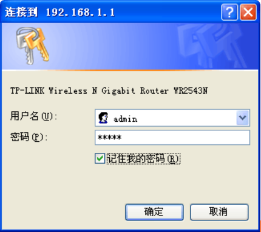
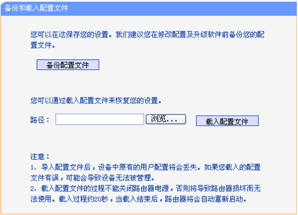

怎样备份原厂路由器配置文件
====================

提示，刷机有风险，如果不当操作，或者有其他意外发生，路由器可能变成砖头，本文系列旨在提供参考，刷机风险由读者自负，作者不承担任何责任，也没有义务提供个别指导

本文作者给 WR2543N 刷 OpenWrt 固件不下10次，因为完全没有经验，有几次刷了后不能进入管理界面，只能用手机3G上网查找解决方案，还好 WR2543N 非常容易进入安全模式，然后重新刷固件，解决了问题。作为初学者，一定要购买容易进入安全模式的路由器

对于本文作者来说，现在已经不需要原厂固件了，但是在第一次刷OpenWrt前，我还是把原厂固件的配置文件作备份，建议读者也是如此

怎样备份原厂固件，WR2543N的原厂说明书说得很详细，建议找出来详细阅读

LAN 和WAN的区别
--------

什么是LAN和WAN,第一次听到这种专业名词容易让人头大

LAN并不是一个单词，而是三个英文单词的缩写：Local Area Network，查出这三个单词的意思，就比较好理解了，就是 **本地区域网络** 的意思。**本地**，比如是室内，公司内，办公室内都是本地，也就是LAN是用来连接本地电脑的

WAN，Wide Area Network，广泛区域网络，也就是连向更广泛的外部的网络，一般家用就是通向ADSL modem，再通过ADSL modem连接互联网

路由器通常有多个LAN口，一个WAN口

在WR2543N路由器的后背，有并排4个的网线插口，叫LAN口，单独的一个网线插口叫WAN口，WAN口旁边还有个USB插口。把ADSL的线插在WAN口。备好一根网线，一头插路由器的任意一个LAN口，另一头插电脑

设置电脑LAN口IP地址
--------

路由器和电脑都处在本地网络里面，为了互相区分，本地网络的每台设备都需要有不同的IP地址

本路由器默认 LAN 口 IP 地址是 192.168.1.1， 默认子网掩码是 255.255.255.0 

电脑的IP地址要和路由器的不同，我们可以设置电脑的本地IP地址为动态获取。如果手动设置IP地址，那么计算机IP地址必须为192.168.1.X
（X）是2到254之间的任意整数），子网掩码须设置为255.255.255.0，默认网关须设置为192.168.1.1

以Windows XP 系统为例，介绍计算机参数的设置步骤

右键单击桌面上的 **网上邻居** 图标，选择 **属性**，在打开的 **网络连接**页面中，右键单击“本地连接”，选择状态，打开“本地连接状态”进行操作。详细步骤请见购机时附带的手册

登录路由器管理界面
--------

   打开网页浏览器，在浏览器的地址栏中输入路由器的
IP地址：192.168.1.1，可以看到下图:  

所示登录界面，输入用户名和密码（用户名和密码的出厂默认值均为admin），单击确定按钮

备份原厂路由器固件配置文件
--------

登录路由器管理界面后，选择菜单，系统工具→备份和载入配置，可以在如下图所示备份或载入路由器配置文件

配置备份功能可以将路由器的设置以文件形式保存到电脑中，以备下次使用；在升级路由器软件或在载入新的配置文件前备份路由器的原有配置，可以有效防止升级软件或载入新配置文件过程中丢失原有配置的问题

配置载入功能则可以将先前保存的或已编辑好的配置文件重新载入

**相关资源**:

- https://fanqiang.software-download.name/