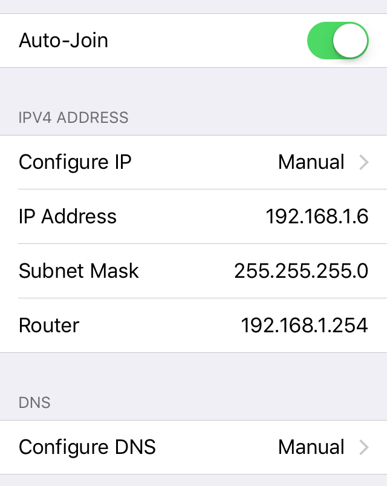
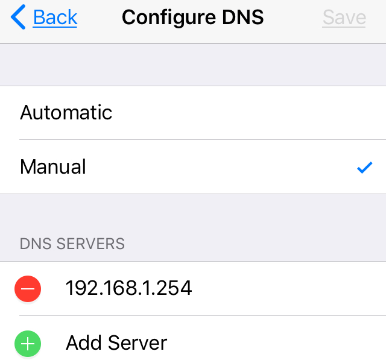

命令行 uci设置OpenWrt ap模式上网参数
==========================

前面章节已经说过了router模式上网的设置方法，主要是设置OpenWrt路由器wan口的拨号上网参数

OpenWrt路由器工作在ap模式下时，自身不需要拨号上网了，设置稍有不同

什么时候需要用到OpenWrt ap模式上网
----------------------

光纤包月或包年上网时，通信公司一般会给一个猫，如果猫里没有设置自动拨号上网，那么OpenWrt路由器就要用router模式，我们自己手动在OpenWrt里设置拨号上网

如果猫里已经设置好拨号上网，从猫的lan拉出一根网线插到电脑的网线接口，电脑直接可以上网了，再把这根网线插到路由器上，这时OpenWrt路由器就要设置成ap模式

如果是公司里或者家里有多个路由器，上级路由器里拉出一根网线插到电脑网线接口，电脑直接可以上网了，再把这根网线插到路由器上，这时OpenWrt路由器作为下级路由器，需要设置成ap模式

OpenWrt路由器AP模式网络设置
------------------------

- **从光猫或上级路由器拉出网线，插到OpenWrt路由器的lan口(注意不是插到wan口)**

- **命令行登录OpenWrt路由器，设置参数**

    假设光猫或上级路由器的IP地址是192.168.1.1，我们设置OpenWrt路由器的lan地址是 192.168.1.254，这也是登录OpenWrt路由器的的地址

        uci set network.lan.gateway=192.168.1.1
        uci set network.lan.dns=192.168.1.1
        uci set network.lan.ipaddr=192.168.1.254

        uci set network.wan.proto=none

        uci commit network

        uci set dhcp.lan.ignore=1
        uci commit dhcp

        uci set wireless.@wifi-device[0].disabled=0
        uci set wireless.@wifi-iface[0].mode='ap'
        uci set wireless.@wifi-iface[0].ssid='eastking'
        uci set wireless.@wifi-iface[0].encryption='psk2'
        uci set wireless.@wifi-iface[0].key='icanfly9876'

        uci commit wireless
        wifi

        /etc/init.d/network restart

**客户端连接OpenWrt路由器**:

如果不需要翻墙，客户端连上OpenWrt路由器后，直接就可以上网了

如果上级路由器没有翻墙，客户端需要通过OpenWrt路由器翻墙，客户端连接到OpenWrt路由器后，按照下面设置：

- 设置客户端连接的的IPv4地址是 192.168.1.6（最后的6不和其他设备的地址相同即可）
- 设置子网掩码为255.255.255.0
- Router(网关)和DNS设为路由器lan口的地址，此处为192.168.1.254

原理：以OpenWrt路由器作为DNS服务器，我们已经把OpenWrt设置成翻墙路由器，连上的客户端自然就可以打败功夫网了

iPhone连接ap模式的翻墙路由器，IPV4设置如上图

iPhone连接ap模式的翻墙路由器，DNS设置如上图

**相关资源**:

- https://fanqiang.software-download.name/