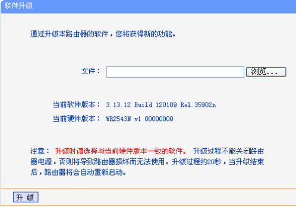
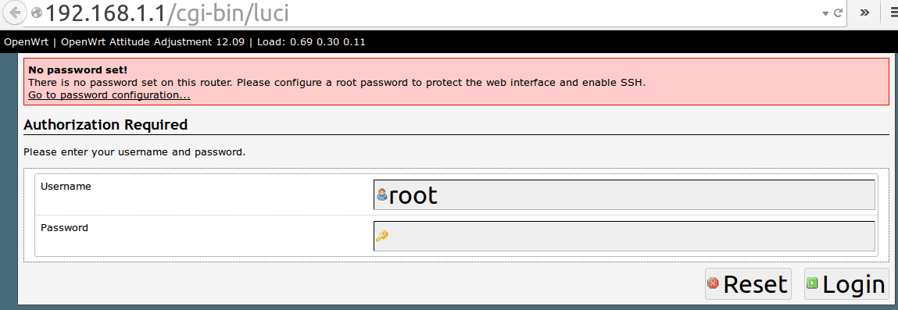

进管理页面刷OpenWrt教程：WR2543路由器为例
===========================

通过有线或无线登录WR2543路由器管理页面
--------

打开浏览器,输入路由器的IP地址: [192.168.1.1](http://192.168.1.1)
--------

回车,在密码验证框,输入用户名: **admin**  密码也是 **admin**

进路由器管理页面进行器固件升级
--------

选择菜单系统工具→ 软件升级

点击 **浏览** 按钮选择下载的文件 **openwrt-ar71xx-generic-tl-wr2543-v1-squashfs-factory.bin**

注意，文件名必须是...factory.bin

再单击 **升级** 进行软件升级。要注意，在刷固件过程中不可停电或其他原因造成中断，否则路由器就变砖了

等待几分钟

等锁形的指示灯不闪了，在浏览器输入地址: [192.168.1.1](http://192.168.1.1)  回车,如果正常的话,就进入了 OpenWrt 的LuCI网页管理界面了

默认用户名是root,默认密码是空。点 **Login** 直接登录

**相关资源**:

- <https://fanqiang.software-download.name/>