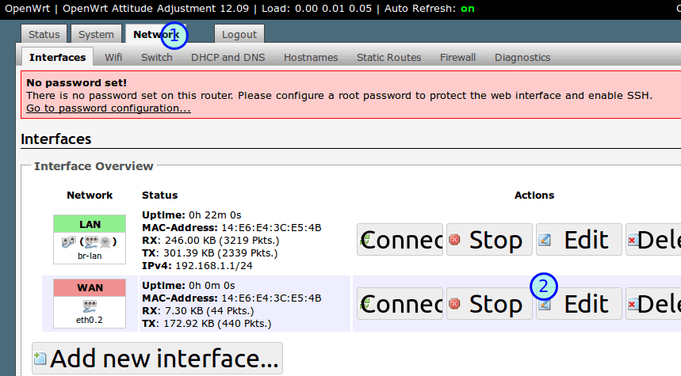
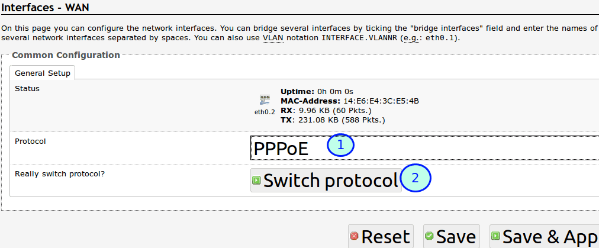
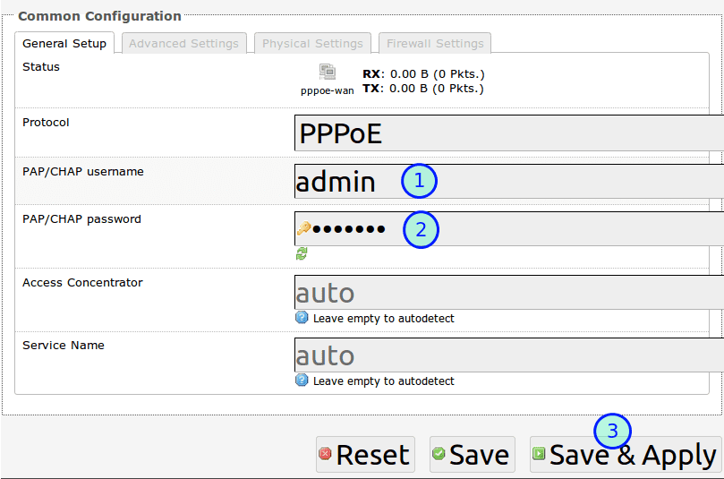

# 网页界面OpenWrt拨号上网设置教程

见面界面登陆路由器后，就可以设置上网参数了。

## 编辑OpenWrt WAN设置
选择上面的 Network，在 Interface里，WAN右边，选择Edit。WAN和ADSL　moderm相连，设置拨号上网自然是在WAN而不是LAN.

	
## 配置OpenWrt拨号上网密码
进去后，在协议 Protocol 下拉列框里，选择拨号上网的协议，也就是 PPPoE, 再点击下面的 Switch Protocol切换协议。

	
## OpenWrt拨号上网用户名密码设置
1. PAP/CHAP username: 拨号上网用户名 
2. PAP/CHAP password:　拨号上网密码
3. 点击 **Save & Apply** 保存并应用设置

这时，连接LAN的电脑应该已经可以上网了，但无线设备还不行。
	
	