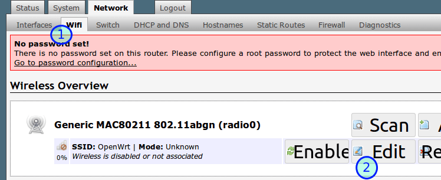
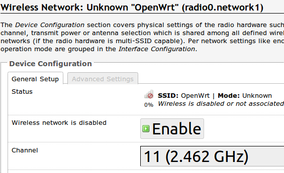
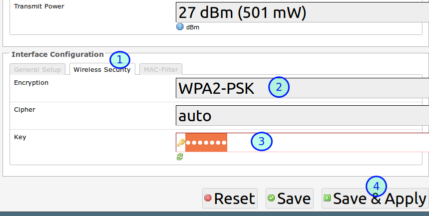
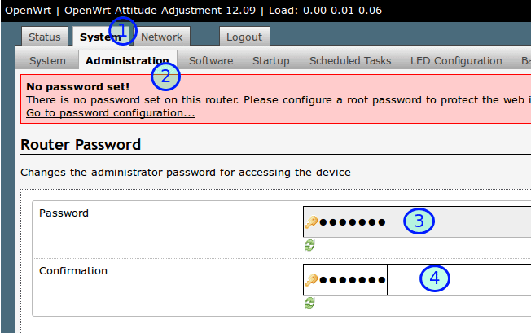

# 网页界面OpenWrt无线(Wifi)设置图文教程

登录OpenWrt路由器后：

## 选择 Network, Wifi, Edit

## 点击Enable按钮，这时无线设备已经可以连上Wifi

默认ESSID就是OpenWrt，没有密码。不想做活雷锋的加个密码吧。

## OpenWrt Wifi密码设置
把ESSID改成 eastking-wr2543,然后：  
- 点击Wireless Security进入OpenWrt无线安全设置
- Encryption加密方式，WPA2-PSK
- Key密码：killgfw
- Save & Apply　保存并应用设置

这时，所有无线设备都可以通过OpenWrt路由器上网了。

## OpenWrt管理界面登录密码设置
你注意到没有，	网页上方有一个红色的框框(No password set!)一直在提示我们： **小人不得不防，OpenWrt叫你设一个路由器管理界面登录密码呢!**

1. 点击最上面的System进入系统设置
2. 再点击Administration进入管理员设置
3. 密码Password: fanqiang
4. 确认密码Confirmation: fanqiang  

5. 其他设置：下面的：
Gateway ports，勾选 **Allow remote hosts to connect to local SSH forwarded ports**（允许远程主机连接本地SSH转发端口）,这样我们就可以用SSH命令行的方式管理路由器。最后点击右下角 Save & Apply保存并应用设置。