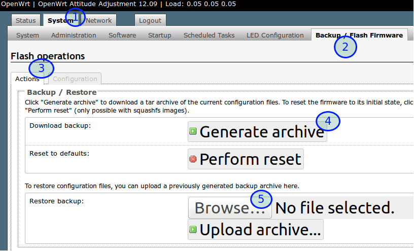

管理页面备份OpenWrt系统固件
=======================

现在有线和无线上网都正常了。应该把现有的OpenWrt设置备份一下，因为我们还要经常折腾OpenWrt，有时一个设置错误，可能就上不了网，有了备份，就可以快速恢复

**选择System系统设置**
**选择Backup / Flash Firmware备份恢复固件**
**Actions动作**
**Generate生成备份文件并保存到电脑**
**如果以后你要恢复备份，就点击Browse...浏览并选择先前备份的文件来恢复**

**相关资源**:

- https://fanqiang.software-download.name/