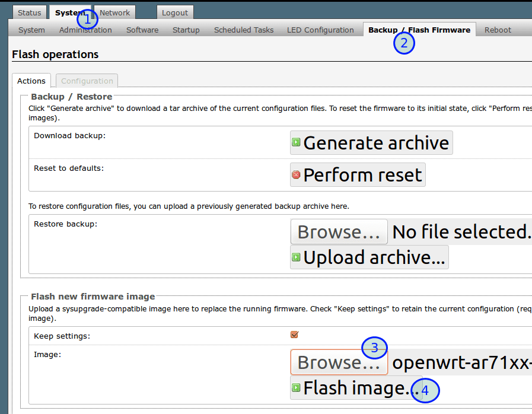

通过LuCI网页界面升级OpenWrt固件
===========================

我们现在已经给TP-Link WR2543N刷上了OpenWrt固件，并且可以正常上网了。如果要升级OpenWrt固件，又该怎么做呢？

有两个途径升级固件：

- LuCI web界面升级
- SSH命令行登录路由器升级

本节就讲 web界面升级固件的方法

下载OpenWrt升级用固件sysupgrade.bin
--------

下载用于WR2543N路由器的升级固件，升级用固件文件名中有sysupgrade字样

还是到OpenWrt Wiki页面 [TP-Link TL-WR2543ND](https://openwrt.org/toh/tp-link/tl-wr2543nd)

点击下载链接，比如 [http://downloads.openwrt.org/releases/18.06.1/targets/ar71xx/generic/openwrt-18.06.1-ar71xx-generic-tl-wr2543-v1-squashfs-factory.bin](http://downloads.openwrt.org/releases/18.06.1/targets/ar71xx/generic/openwrt-18.06.1-ar71xx-generic-tl-wr2543-v1-squashfs-factory.bin) 
其实这个固件的核心和我们先前安装的...factory.bin一样，我们是出于实验目的，演示升级固件的方法，

用前文讲过的方法从网页登录OpenWrt路由器
--------

开始升级OpenWrt固件
--------

1. System系统
2. Backup / Flash Firmware备份或刷新固件
3. Flash new firmware, Browse...选择我们刚下载下来的固件
4. Flash image...刷新固件  

    注：如果Keep settings保持勾选，升级固件后，原来的设置就会保留，不用重新设置拨号上网参数
