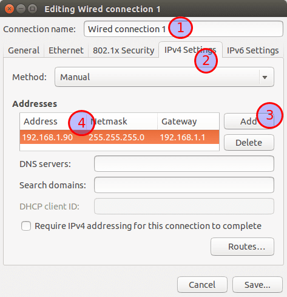
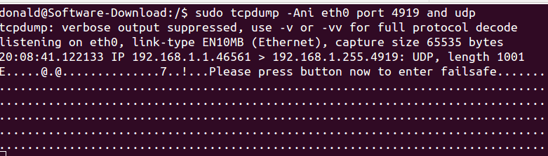
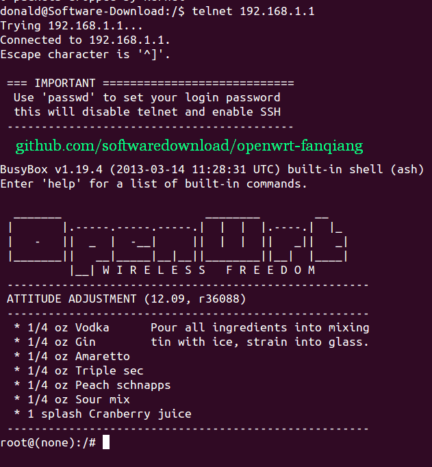
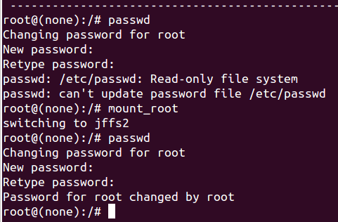

# 怎样进入OpenWrt 安全恢复模式(WR2543N为例)

有时候，我们可能操作失误，无法进入LuCI网页界面管理恢复固件，这时就需要进入安全模式来恢复了。

不同的路由器，进入安全模式的方法可能有所差别，本文系列适用于 TP-LINK WR2543N。

安全模式是玩OpenWrt的救命仙丹。能熟练进入安全模式来恢复设置，是OpenWrt已经上手的一个标志。

进入安全模式时，没有无线连接可用，所以我们要有线的方式登陆OpenWrt。OpenWrt默认的IP地址是192.168.1.1，我们要设置电脑有线连接的IP地址类似于192.168.1.x, 其中x是2至255的数字。

WR2543N无线路由器进入OpenWrt安全模式的方法：

1. 用网线把路由器和电脑连接起来，设置电脑网卡的IPv4地址

	以Ubuntu为例，点击桌面右上角连接符号，选择 **Edit Connections**, 再选择 Ethernet连接，点击　Edit 按钮，在弹出的窗口中选择 IPv4 Settings, Method选择Manual，Address栏点击Add，设置如下：
	* Address: 192.168.1.90
	* Netmask: 255.255.255.0
	* Gateway: 192.168.1.1
	
	

2. 在Ubuntu运行命令：  

		sudo tcpdump -Ani eth0 port 4919 and udp

3. 重启路由器,当WR2543N的锁形指示灯刚一开始闪烁时，立即按路由器背面的wps按钮3次

4. Ubuntu命令行界面出现：
	> 
	> Please press button now to enter failsafe
	
	
	
5. Ubuntu命令行执行(有时可以不需tcpdump直接telnet)：

		telnet 192.168.1.1
	
	这时就成功登陆了OpenWrt，如下图:
	

6. 设置登陆OpenWrt SSH登陆密码:
	
		passwd
		#输入密码 fanqiang
	
	如果出现：
	
		passwd: /etc/passwd: Read-only file system
		passwd: can't update passwd file /etc/passwd

	就输入 `mount_root` 再重新passwd设置管理员密码。如下图：
	

telnet登陆路由器后，可以用vi命令修改设置。

这时如果你试图用浏览器登陆192.168.1.1进入管理界面的话，可能失败。

重启路由器，路由器锁形指示灯先是慢闪，到变成常亮时，你又可以登陆 192.168.1.1管理界面。一切恢复正常。
