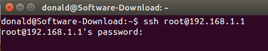
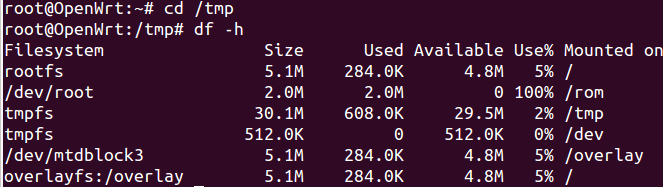
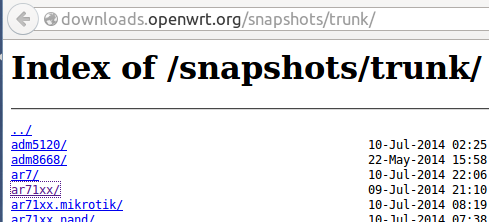

# OpenWrt sysupgrade 命令行更新固件到最新版

下面我们要使用 sysupgrade 更新固件到snapshot最新版。

要注意的是，trunk包含试验的功能，可能不稳定，刷机风险自己承担。

在浏览器里登陆 192.168.1.1 进行固件升级是比较简单的。今天我们要尝试的的是命令行刷机升级。命令行的方式更强大。

## SSH登录路由器

在Ubuntu里，按Ctrl+Alt+T打开命令行终端，输入： 

	ssh root@192.168.1.1

输入密码，登录成功。

## 进入OpenWrt /tmp目录
	cd /tmp

## 检查OpenWrt路由器是否有足够的内存
	df -h

可以看出， **/tmp** 还有29.5MB可用空间，而升级固件在3MB左右，足够了。  

## 下载OpenWrt最新trunk版本固件
1. 在Ubuntu里浏览器打开 [http://downloads.openwrt.org/snapshots/trunk/](http://downloads.openwrt.org/snapshots/trunk/)

2. TP-LINK WR2543N路由器的芯片类型是ar71xx，就点击 [ar71xx](http://downloads.openwrt.org/snapshots/trunk/ar71xx/) 目录进入。要注意，路由器的芯片类型千万不能搞错，不同路由器很可能是不同的。  

3. TP-LINK WR2543路由器的Flash类型为 generic，于是进入了 http://downloads.openwrt.org/snapshots/trunk/ar71xx/generic/

4. 按Ctrl+F查找自己的路由器型号。比如我输入的是 **wr2543**, 有两个固件，升级用的是 **sysupgrade.bin**文件。右键点击该链接，复制下载地址。在FireFox里是 **Copy Link Location**复制链接地址。

4. 回到Ubuntu命令行终端， 下载固件到 **/tmp** 目录。TP-LINK wr2543路由器是这样的:
		root@OpenWrt:/tmp# wget http://downloads.openwrt.org/snapshots/trunk/ar71xx/generic/openwrt-ar71xx-generic-tl-wr2543-v1-squashfs-sysupgrade.bin

## md5校验，确保下载的固件完整:
		root@OpenWrt:/tmp# wget http://downloads.openwrt.org/snapshots/trunk/ar71xx/generic/md5sums  
		root@OpenWrt:/tmp# md5sum -c md5sums 2> /dev/null | grep OK  
		openwrt-ar71xx-generic-tl-wr2543-v1-squashfs-sysupgrade.bin: OK		

输出结尾是OK，说明固件是完整的。

## OpenWrt sysupgrade命令升级OpenWrt固件
		root@OpenWrt:/tmp# sysupgrade -v openwrt-ar71xx-generic-tl-wr2543-v1-squashfs-sysupgrade.bin 
		... 
		Upgrade completed
		Rebooting system...

过约2分钟，等路由器重启成功，如果没有意外，会发现有线和无线上网都正常。但浏览器192.168.1.1无法登陆，因为snapshots版本固件是不带LuCI网页管理界面的。没有也好，可以节省路由器的存储空间，也可以学习一下命令行管理OpenWrt路由器。

#### 参考：
* [generic.sysupgrade](http://wiki.openwrt.org/doc/howto/generic.sysupgrade)
* [sysupgrade source code](https://dev.openwrt.org/browser/trunk/package/base-files/files/sbin/sysupgrade)
* [sysupgrade doc](http://wiki.openwrt.org/doc/techref/sysupgrade)