Android 安卓手机安装 shadowsocks 影梭翻墙、科学上网教程
===================

本教程可以用于小米、华为、三星、VIVO、OPPO等安卓手机安装 shadowsocks 翻墙

下载 shadowsocks-Android 安卓版翻墙软件
-------------------

如果手机已经连上了已经翻墙的路由器，那么可以这样操作：

- 打开浏览器，地址栏输入 https://www.google.com
- 搜索 `android shadowsocks`

    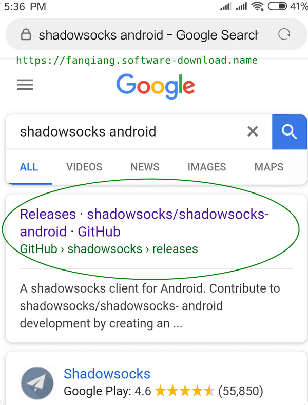
- 如上图，第一个搜索结果点击进去就是了

如果手机没有连上翻墙网络，那么可以直接从开源项目地址 github 下载。点击下面链接：

[https://github.com/shadowsocks/shadowsocks-android/releases](https://github.com/shadowsocks/shadowsocks-android/releases)

- 进入了Android shadowsocks 下载页面，如下图这样：

    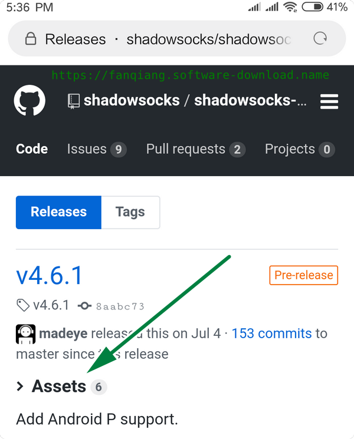

- 点击 Assets 展开下载文件列表，如下图：

    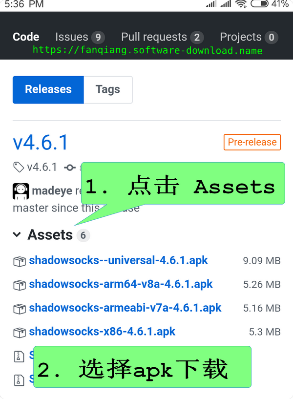

    点击 `shadowsocks-arm64...` 或者 `shadowsocks--universal...` 开始下载。手机安装第三方软件的方法可以搜索手机品牌的软件安装教程

Android 安卓手机设置 shadowsocks 翻墙配置文件
-------------------------------

- 启动 shadowsocks后，点击右上角的加号创建新的科学上网配置文件，如下图

    

- Android shadowsocks 翻墙参数设置

    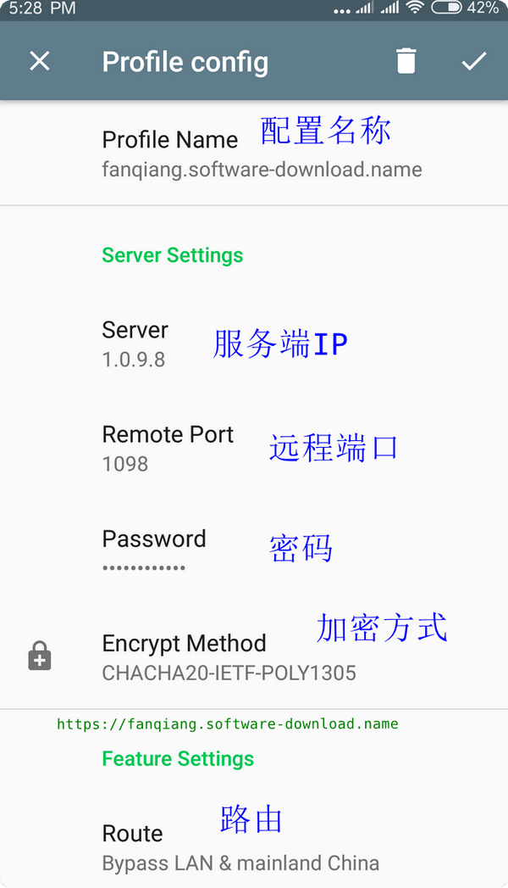

  - Profile Name 配置名称，只是助记。这里写了 fanqiang.sofware-download.name
  - Server 服务器IP地址，`1.0.9.8` 改成你自己的
  - Remote Port 远程端口，`1098` 改成实际端口
  - Password 密码
  - Encrypt Method 加密方法，推荐  `CHACHA20-IETF-POLY1305`
  - Route 路由，一般选 Bypass LAN and mainland China 绕过局域网及中国大陆地址
  - 点右上角的对号保存翻墙设置，如果以后再次编辑也是点击这里。如下图

      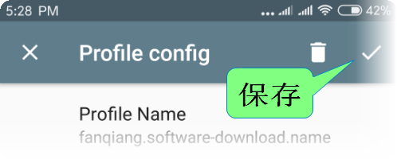

Android 安卓手机 shadowsocks 设置选项
-------------------------

- 点击左上角的三个横杠，进入高级设置界面，如下图：

    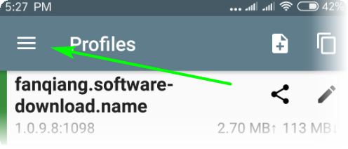

- 选择 Settings 设置选项，如下图：

    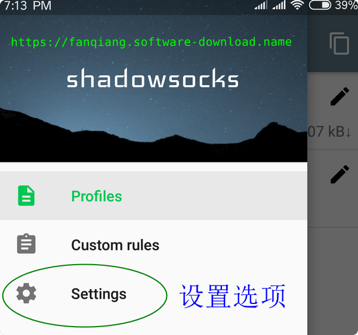

- Service mode 服务模式，选 VPN，如下图：

    

- 如果 [shadowsocks 服务端开启了 TCP fast open](06.01.md)，则可以滑动开启 TCP Fast Open。图中已经开启了，翻墙速度会有提升

- 再次点击左上角三横杠，然后点击 Profiles 配置文件 回到配置文件界面，如下图：

    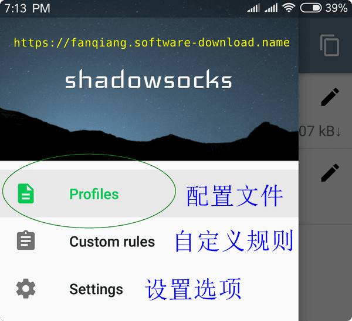

Shadowsocks Android 安装 Simple Obfs 插件
----

经测试，如果没有安装插件，则翻墙流量可能被干扰。下面我们来安装一下 Simple Obfs 混淆插件

Shadowsocks Android 界面里并没有安装插件的功能，我们单独下载安装插件 .apk 后，插件选项才变成可选

- 下载 Simple obfs Android 插件

    注意，[simple-obfs-android](https://github.com/shadowsocks/simple-obfs-android) 官方插件 release v0.0.5 [并不支持 WebSockets](https://github.com/shadowsocks/simple-obfs-android/issues/11)，因此不支持 http 模式，我们需要下载网友新编译的版本

    从下面地址下载 Simple obfs 插件：

    [https://github.com/xianren78/simple-obfs-android/releases](https://github.com/xianren78/simple-obfs-android/releases)

    从手机下载 **obfs-local-debug.apk** 并安装

- Shadowsocks Android 设置 simple obfs 插件

    - 打开 **Profile Config**
    - **Plugin** 选择 **Simple Obfuscation**
    - **Configure...**
        - Server Settings(服务器设置), Obfuscation wrapper：**http**
        - Feature Settings(功能设置)， Obfuscation hostname: **32.kige.com**
        - 点击右上角 对号 保存设置

        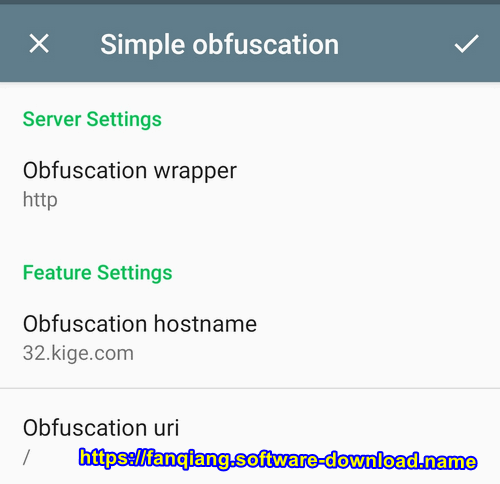

    注意，**32.kige.com** 改成你实际使用的子域名

    服务器上如何设置一个子域名，请参考本文附录

Android shadowsocks 安卓手机影梭科学上网测试
----------------

- 点击配置文件名称 `fanqiang.software-download.name` 以选中配置文件，选中后左边有绿色的竖条

    你可能会问，我就一个配置文件，为什么还要选中配置文件才能使用？这是考虑到有的人可能拥有多个服务端，或者测试多个配置文件，于是左边有绿色的竖条表示选中的配置，如果是灰色竖条就表示没有选中，很直观

    如果要删除一个不需要的配置文件，向左滑动就可以了

- 右下角有个圆形图标，中间有个梭子，灰色表示没有开启翻墙，点击它，图标会变成绿色，表示 shadowsocks 已经在连接服务端

    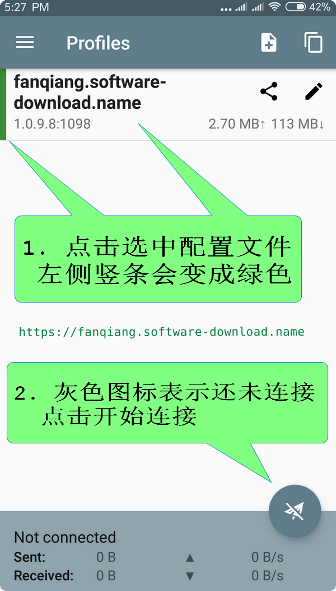

    如下图，绿色图标表示 shadowsocks 已经在工作了

    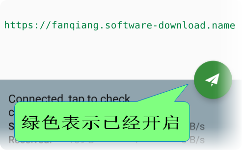

- 测试安卓手机翻墙有没有成功

    如果手机已经连接了翻墙路由器，先关闭WIFI 连接，改用流量上网

    打开浏览器，导航到:

    [https://m.youtube.com](https://m.youtube.com)

    如下图，用手机流量科学上网看 youtube，速度挺不错

    

    如果打不开 youtube，就要仔细检查 各项设置是否正确

最后提醒一下，科学上网结束时，要点击 shadowsocks-Android 右下角圆形图标停止翻墙，否则手机电量会哗哗往下掉

**相关资源**:

- [Linux 服务器安装 Simple-obfs 混淆插件](https://fanqiang.software-download.name/ebook/04.5.html)
- [Simple Obfs 混淆插件的工作原理](https://fanqiang.software-download.name/ebook/04.6.html)
- [OpenWrt 路由器使用 Simple Obfs混淆插件](https://fanqiang.software-download.name/ebook/04.7.html)
- [Windows翻墙最好方法：shadowsocks-libev + simple-obfs + TFO教程](https://fanqiang.software-download.name/ebook/04.8.html)
- [Windows上使用配置 Simple Obfs 混淆插件](https://fanqiang.software-download.name/ebook/04.9.html)
- <https://github.com/shadowsocks/simple-obfs>
- <https://github.com/shadowsocks/shadowsocks-android/releases>
- <https://github.com/softwaredownload/openwrt-fanqiang/blob/master/ebook/06.01.md>
- <https://fanqiang.software-download.name/>