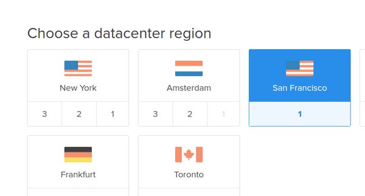

# 翻墙软件Shadowsocks-libev服务端设置

要利用 shadowsocks-libev翻墙，首先要有一台国外的服务器安装并运行shadowsocks 服务端。如果还没有服务器,可以到 [Digital Ocean](https://www.digitalocean.com/?refcode=89497bd485e0) 购买一台SSD虚拟服务器VPS，价格非常便宜，重启的时间在20秒内，速度很快，有独立IP，收费以小时计算，服务一流。

注册DO并绑定支付方式后，登陆，然后Create Droplet:

- Choose an image 选择 Ubuntu 64位：  
	
- Choose a site 一般512MB那款就够了：  
	
- Choose a datacenter region 选择San Francisco：  
		
- Select additional options, 勾选IPv6：  
	
- Choose a hostname, 只是助记，比如ubuntu-512mb-nyc3-shadowsocks
- Create 创建虚拟服务器

创建服务器后如何设置ssh登陆，请自行搜索相关教程。

## Ubuntu安装 shadowsocks-libev服务端

	#Add GPG public key:
	wget -O- http://shadowsocks.org/debian/1D27208A.gpg | sudo apt-key add -

	# Ubuntu 14.04 or above
	sudo add-apt-repository "deb http://shadowsocks.org/ubuntu trusty main"
	
	# Debian Wheezy, Ubuntu 12.04 or any distribution with libssl > 1.0.1
	sudo add-apt-repository "deb http://shadowsocks.org/debian wheezy main"
	
	sudo apt-get update
	sudo apt-get install shadowsocks-libev

上述命令的效果：
- 把　deb http://shadowsocks.org/ubuntu trusty main　加到　/etc/apt/sources.list
- 安装ss-local ss-redir ss-server ss-tunnel到 /usr/bin
- 启动文件　/etc/init.d/shadowsocks-libev
- 配置文件 /etc/shadowsocks-libev/config.json (旧版是/etc/shadowsocks/config.json)
- 一些默认启动配置 /etc/default/shadowsocks-libev （旧版是/etc/default/shadowsocks）

## 编辑shadowsocks-libev配置文件
	sudo vi /etc/shadowsocks-libev/config.json
	
改成类似如下：	

	{
		"server":"1.0.9.8",
		"server_port":1098,
		"password":"killgfw",
		"method":"aes-256-cfb"		
	}

必须把server　IP地址改成你自己的，其他可以不改。如果访问变慢，时断时续，这可能是受到干扰了，可以尝试改变加密方式，如改成bf-cfb。

## 控制shadowsocks-libev的方法
	sudo service shadowsocks-libev start
	sudo service shadowsocks-libev stop
	
	#设置随机启动 Shadowsocks-libev. 新版已经不需要手动设置随机启动
	#sudo update-rc.d shadowsocks-libev defaults 99
	
	#取消shadowsocks-libev随机启动	
	#sudo update-rc.d -f shadowsocks-libev remove	

## 查看ss-server是否已经启动并且带有 -u启动参数
	ps ax | grep ss-server
	
如果启动正常，返回结果类似如下：
	
	/usr/bin/ss-server -c /etc/shadowsocks-libev/config.json -a root -u -f /var/run/shadowsocks-libev/shadowsocks-libev.pid
	
注意其中有-u。如果shadowsocks客户端启用了udp relay, 而服务端启动时不带-u参数，翻墙自然就失败了。

## 启动shadowsocks-libev服务端
	sudo service shadowsocks-libev start
	
### Ubuntun源码编译 shadowsocks-libev 最新版(可选)
	sudo apt-get install build-essential autoconf libtool libssl-dev git
	cd ~/Downloads
	git clone https://github.com/shadowsocks/shadowsocks-libev.git
	cd shadowsocks-libev
	./configure && make

	# 使用最新版shadowsocks-libev服务端软件 ss-server
	sudo service /etc/init.d/shadowsocks-libev stop
	sudo cp ~/Downloads/shadowsocks-libev/src/ss-server /usr/bin/	
	sudo service /etc/init.d/shadowsocks-libev start
	

#### 参考：
- [shadows-libev on github](https://github.com/shadowsocks/shadowsocks-libev)
- [create a simple linux daemon](http://xiaoxia.org/2011/11/15/create-a-simple-linux-daemon/)
