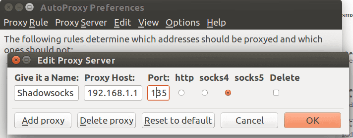

OpenWrt路由器运行 shadowsocks-libev ss-local 客户端
====================================

shadowsocks-libev for OpenWrt 要和 OpenWrt 版本一致，否则可能无法安装，或者安装了不能启动

shadowsocks-libev选择 OpenSSL 版还是 PolarSSL 版
--------

根据依赖的 SSL 库可分为 OpenSSL 和 PolarSSL 两种版本OpenSSL 版依赖 libopenssl, 支持加密方式多, 体积大
PolarSSL 版依赖 libpolarssl, 体积小, 加密方式少

如果内存大就选OpenSSL版，反之则选PolarSSL版

安装shadowsocks-libev客户端到OpenWrt路由器（星号替换成实际的字符）
--------

    ~/Downloads$ scp shadowsocks-libev-polarssl_*_ar71xx.ipk root@192.168.1.1:/tmp/
    ~/Downloads$ ssh root@192.168.1.1
    root@OpenWrt:~# cd /tmp
    root@OpenWrt:~# opkg install shadowsocks-libev-polarssl_1.*.*_ar71xx.ipk

修改shadowsocks-libev客户端配置
--------

    root@OpenWrt:~# vi /etc/shadowsocks-libev/config.json

改成类似如下：

    {
        "server":"1.0.9.8",
        "server_port":1098,
        "local_port":7654,
        "password":"killgfw",
        "method": "aes-256-cfb"
    }

注意，server IP必须修改你的实际IP。其他可以保持默认

shadowsocks代理上网测试
--------

- 启动shadowsocks 客户端:

    root@OpenWrt:~# ss-local -c /etc/shadowsocks-libev/config.json

- Ubuntu浏览器代理上网设置，以FireFox配合AutoProxy为例，增加Proxy Server, Proxy Host填192.168.1.1,Port是7654,　勾选Sock5.如下图：

    

Ubuntu设置AutoProxy的默认代理是shadowsocks,就可以打开被墙的网站如[YouTube.com](http://www.youtube.com)

以前我在每台电脑上都运行一个shadowsocks客户端，每台电脑都要像上面这样配置浏览器代理上网翻墙。但是还是太复杂，如果家里有十台上网设备，所有要连国外网站的软件都可能要配置代理访问，有些软件还根本没有设置代理的接口。有没有更简单的方法呢？

现在路由器里安装了shadowsocks，所有有线和无线上网设备都不用分别安装shadowsocks了，非常方便
