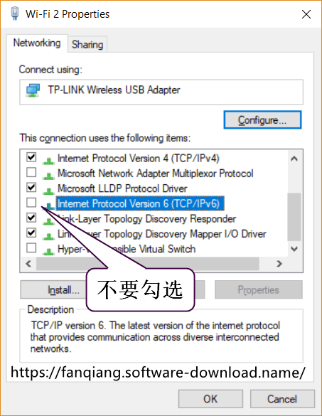

OpenWrt连接失败，可以上网但无法科学上网，为什么
===============================

给路由器刷上OpenWrt，并按照 [本教程](https://fanqiang.software-download.name "OpenWrt路由器翻墙教程") 设置了服务端和客户端，但还是有问题，怎么办？
C
## 翻墙后国外 AI 如 OpenAI、Claude、Copilot 拒绝提供服务，怎么办

本项目的 OpenWrt 路由器翻墙，即使启用全局翻墙模式，还是有可能泄露部分本机真实信息并且被国外 AI 公司识别，导致被对方拒绝提供服务

解决办法，采用 [Overtls + tun2proxy 翻墙](05.42.md)，这时 tun2proxy 接管了本机的全部流量并转发到 overtls 监听的端口。除非你的服务端 IP 地址被对方列入黑名单，否则，这种翻墙方法是十分安全、可靠的

有的网站能翻墙，有的网站翻墙失败，google打不开或打开非常慢，这是怎么回事
-------------------------------

- This site can’t be reached

    gfw.com unexpectedly closed the connection.

    ERR_CONNECTION_CLOSED

- This site can’t be reached

    The connection was reset

    ERR_CONNECTION_CLOSED

- This site can’t be reached

    www.tumblr.com took too long to respond

    ERR_TIMED_OUT

有不少朋友遇到过上面这些情况，打开 https://google.com 或者 https://youtube.com 没有问题，但是有的网站很难打开，或者干脆打不开

比如 https://tumblr.com  或者 https://flickr.com 有时就很难打开

这是怎么回事，百思不得其解，如果说翻墙配置不对，又怎么解释有的网站翻墙没有问题呢

难道电脑系统设置有问题？查找各种教程，一大通修改后，还是不行

再换用不同的浏览器，Chrome, FireFox, Edge, IE，不行的还是不行

难道 GFW 成精了，不是说好了建国后不能成精的吗

最后的努力，不成功就向 妖精 投降算了：

- 更换成最好的加密方式
- 加上流量混淆插件
- 更换服务端IP地址、端口
- 软件都手动编译到最新版

忙活了几天，终于升级完成，一测试，不行的还是不行，忍不住，胸膛起伏不定，犹如万马奔腾...

且慢向妖精投降！妖精最终总是被收服的，或收到后宫，或收作坐骑

大道至简，不区分国内、国外 IP地址，全局翻墙，所有流量都走 shodowsocks 加密通道往往能解决这个问题

现在的网页往往比较复杂，会引用各种外部组件，这些外部组件可能是属于不同的 IP 地址，还有 CDN 动态加速，有时可能会出现十分复杂的情况

比如你访问一个著名网站，网站必定会判断你的区域，首先根据你的 IP 地址定位你在 New York

网站有许多组件，有的组件可能根据你的计算机特征，比如系统语言判断你的区域，于是可能判断你的区域为中国，于是到中国的CDN取内容给你...数据在全球来回打转，不但把路由器拖累了，也把网站搞糊涂了，导致网站打开的速度非常慢，或者打不开

我们在路由器里区分国内 IP 和 国外 IP 的本意是为了打开网页更快，然而，有时却适得其反，甚至导致网页根本打不开

为了方便在需要时切换不同的翻墙方式，2018年9月起，`/usr/bin/ss-firewall-asia` 分成三个文件：

- /usr/bin/ss-firewall-global
- /usr/bin/ss-firewall-china
- /usr/bin/ss-firewall-asia

分别是：默认，全局翻墙，忽略中国IP，忽略亚洲IP

极少数网站比如 www.dropbox.com 打不开， 怎么办
--------------------

www.dropbox.com 服务器默认使用IPv6地址，DropboBox Windows 电脑客户端也默认连接到服务端IPv6地址，翻墙固件不支持 IPv6 翻墙，此种情况可能翻墙失败

解决方法是网络连接的属性里不要勾选 **Internet Protocol Version 6 (TCP/IPv6)**

以 Windows 系统为例：

- 按 `Windows` 键，中文系统输入 `控制面板`，英文系统输入 `control panel`，然后打开旧版的控制面板
- 点击 `Network and internet`
- 点击 `Network and Sharing Center`
- 点击在用的网络连接，如 `Wi-Fi fanqiang`
- 点击 “属性” `Properties`
- 不勾选 `Internet Protocol Version 6(TCP/IPv6)`
- 点击 `OK` 保存设置

全局不能翻墙，首先ping 服务器的 ip 看看速度怎么样
--------

    ping 1.0.9.8

如果 ping 不通，考虑换服务器IP地址

不能翻墙，国内网能上，服务器IP能 ping 通
---------

可能是服务器端口被 GFW 屏蔽了。可以这样测试服务器端口是否被屏蔽

在本地 Linux 下， 或者在 Windows 里安装 **MSYS2**, 执行如下命令：

    $ telnet 109.8.7.6 1098
    Trying 109.8.7.6...
    Connected to 109.8.7.6.
    Escape character is '^]'

    telnet> q
    Connection closed

**109.8.7.6** 是服务器 IP 地址， **1098** 是端口，如果结果显示 **Connected to**，说明端口是可以连接的，否则是端口可能被 GFW 屏蔽了，换一下 SS 的服务器端口可能就可以了。这种例子我碰到过

附带说明，ping 通端口后，按 **Ctrl + ]** 退出连接，再按 **q** 退出 **telnet**

如果 ping 不通或连接时间过长，按 **Ctrl + c** 中断

ping IP能通，telnet IP port 能连上，翻墙时好时坏，怎么办
----

这是翻墙被干扰了，默认翻墙流量走服务端不常用端口，网管会怀疑你在做什么，从而干扰你，这个干扰力度各地不一，有的地区不怎么干扰，有的地区你没连几分钟就干扰你。解决办法是给 Shadowsocks 加上插件。推荐使用 [Simple Obfs 插件](https://fanqiang.software-download.name/ebook/04.5.html)，并使用 **http** 模式，这种模式你需要有自己的服务器和域名

检查shadowsocks服务端启动时有没有带上 -u参数
--------

> -u enable udprelay mode
> TPROXY is required in redir mode

本教程使用的，也就是官方的[shadowsocs-libev](https://github.com/shadowsocks/shadowsocks-libev)服务端是默认启动带上 -u 参数的。但有的朋友可能使用其他版本的服务端，如Python版，就不能保证服务端启动时默认就带 -u 参数

可以这样查询服务端是否启动，及启动参数：

    $ ps -aux | grep ss-server
    #.../usr/bin/ss-server -c /etc/shadowsocks-libev/config.json -a root -u -f /var/run/shadowsocks-libev/shadowsocks-libev.pid

可见上面启动时已经带了 -u 参数

登录OpenWrt路由器查询翻墙相关进程有没有启动
--------

    root@eastking:~# ps | grep ss-
    #.../usr/bin/ss-redir -b 0.0.0.0 -c /etc/shadowsocks-libev/config.json -f /var/run/shadowsocks.pid
    #.../usr/bin/ss-tunnel -b 0.0.0.0 -c /etc/shadowsocks-libev/config.json -l 3210 -L 8.8.4.4:53 -u

    root@eastking:~# ps | grep dnsmasq
    #.../usr/sbin/dnsmasq -C /var/etc/dnsmasq.conf -k -x /var/run/dnsmasq/dnsmasq.pid

上面的查询显示，ss-redir ss-tunnel dnsmasq都已经正常启动

有时虽然ss-redir ss-tunnel dnsmasq等进程都在，但已经失去响应了，这就需要：

重启 shadowsocks，登录路由器，运行命令：
--------

    /etc/init.d/shadowsocks restart

`restart` 内部分 `stop` 和 `start` 两步执行，实际测试发现，少数时候 `stop` 并不能关闭 shadowsocks相关进程，那么只能：

按路由器背后的电源重启OpenWrt路由器
--------

翻墙不稳定，有时能连上被墙网站，有时连不上
--------

shadowsocks-libev 加密翻墙的方式加大了墙的辨识难度，但不是不可能被辨识。因此，还是有可能受到干扰的。解决方法：更换加密方式，服务端 IP 地址或者服务端的端口

如果是轻度使用翻墙，一般情况即使暂时翻墙不稳定，问题也不大。如果重度使用翻墙，可能被特别注意，被干扰的机率会更大

登录路由器用dig查询被墙域名
--------

本教程预编译的翻墙固件都安装了 bind-dig，方便调试

注：本教程默认的 tunnel 转发端口都是 3210

正常的结果类似如下：

    root@eastking:~# dig @localhost -p 3210 google.com

    ; <<>> DiG 9.9.7-P3 <<>> @localhost -p 3210 google.com
    ; (2 servers found)
    ;; global options: +cmd
    ;; Got answer:
    ;; ->>HEADER<<- opcode: QUERY, status: NOERROR, id: 38460
    ;; flags: qr rd ra; QUERY: 1, ANSWER: 11, AUTHORITY: 0, ADDITIONAL: 1

    ;; OPT PSEUDOSECTION:
    ; EDNS: version: 0, flags:; udp: 512
    ;; QUESTION SECTION:
    ;google.com.                    IN      A

    ;; ANSWER SECTION:
    google.com.             299     IN      A       74.125.226.33
    google.com.             299     IN      A       74.125.226.36
    google.com.             299     IN      A       74.125.226.32
    google.com.             299     IN      A       74.125.226.38
    google.com.             299     IN      A       74.125.226.41
    google.com.             299     IN      A       74.125.226.39
    google.com.             299     IN      A       74.125.226.35
    google.com.             299     IN      A       74.125.226.46
    google.com.             299     IN      A       74.125.226.37
    google.com.             299     IN      A       74.125.226.40
    google.com.             299     IN      A       74.125.226.34

    ;; Query time: 290 msec
    ;; SERVER: 127.0.0.1#3210(127.0.0.1)
    ;; WHEN: Mon Dec 28 11:55:30 CST 2015
    ;; MSG SIZE  rcvd: 215

仔细检查每一项翻墙配置
--------

还是不能翻墙？也有可能是某项配置有误，仔细检查教程中讲到的每一项翻墙设置，确保没有错误

有一次我给路由器新刷翻墙固件后，总是不能翻墙。于是逐项检查，发现了某项配置有误，修正后就可用了

有几次，我发现 /etc/dnsmasq.d/gfwlist.conf 文件成了空文件，恢复后就正常了

**相关资源**:

- <https://fanqiang.software-download.name/>