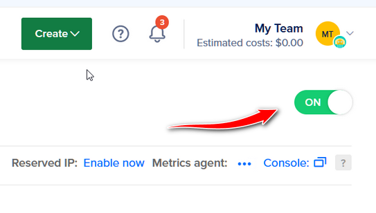
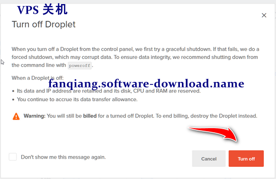
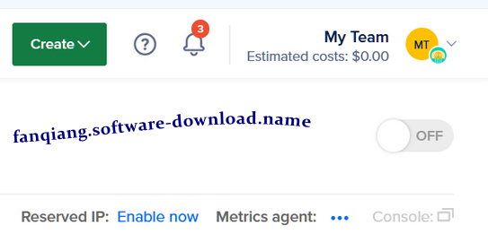
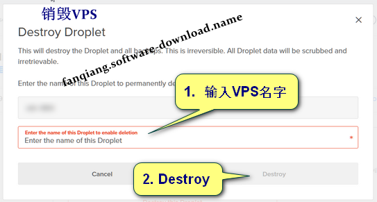

快速、极省钱更换 DO VPS IP 地址
===

DO 是 [Digital Ocean](https://m.do.co/c/89497bd485e0) 的缩写

DO 是业界最著名、技术最成熟、价格也很香的 VPS 服务商，详细介绍见前文 [零起点DO VPS shadowsocks-libev 翻墙设置教程](03.9.md)

你按照上述教程设置好 VPS 以后，有时你可能想要更换一下 VPS 的 IP 地址，原因可能是你要注册某个服务的多个账号，或者原来的 IP 地址被屏蔽了，这时你选用 DO 的优势就体现出来了，更换一个 IP 地址仅需几分钟时间，而所需的费用可以忽略不计（可能几分钱吧），这么省钱的原因是因为 DO 是按照精确使用时间来计费的

准备工作
---

如果你还没有 DO 的VPS，可以按照 [零起点DO VPS shadowsocks-libev 翻墙设置教程](03.9.md) 创建 VPS（在 DO 叫作 Droplet）

Droplet 的名字可以自己起，如 ubuntu-shadowsocks，设置好 shadowsocks-libev 服务端，其中server写 `["[::0]","0.0.0.0"]` 并测试通过。我们用这种格式指定 IP 地址，更换 IP 后就不用修改 shadowsocks-libev 服务端的配置文件了

VPS 关机
---

DO VPS 关机有二种方式

1. 在本机用 ssh 登录 VPS 执行关机
2. 登录 [Digital Ocean](https://m.do.co/c/89497bd485e0) 网站执行关机

如果你的VPS有重要的用途，比如你有个论坛，随时可能有新的帖子需要写入数据库，这时你可以用第一种方式，即在本机用 ssh 登录 VPS 执行关机

如果你的 VPS 没有复杂的用途，可以用第二种方式，即在 [Digital Ocean](https://m.do.co/c/89497bd485e0) 网站执行关机

1. 在本机用 ssh 登录 VPS 执行关机的方法

    ssh 登录 VPS 后 执行命令：

    > sudo poweroff

2. 登录 [Digital Ocean](https://m.do.co/c/89497bd485e0) 网站执行关机的方法

    登录后，管理页面的左边是侧边栏，点击 `MANAGE`(管理) 打开子菜单，点击子菜单里的 `Droplets`，在右侧会显示出所有的 VPS，点击相应的 VPS 的名字进入该 VPS 的管理页面，页面的右上侧有个写着 `ON`（目前状态是开机）的绿色滑动按钮，如下图：

    

    点击这个 `ON` 按钮，会弹出一个提示页面，如下图：

    

    这个页面上的文字提示你关机以后，你的VPS还占用IP和空间等资源，因此关机期间仍旧在计费，如果你想要停止计费，就要 destroy the Droplet（销毁这个VPS）

    目前我们还不能销毁这个 VPS，因为我们还没有制作 Snapshot（快照备份）

    果断点击右下角的 `Turn off` （关机）按钮

    过了几秒，如果你注意观察的话就会发现，关机完成后，页面左侧的水滴图标会变灰，页面右上侧的  `ON` 按钮会变成灰色的 `OFF` 按钮，这表示我们可以进入下一步操作了。OFF 按钮如下图

    

创建 VPS Snapshot（快照）
---

每个 VPS 的管理页面有自己的左侧边栏，找到并点击 `Snapshots`(快照)

打开的页面中间，`Enter snapshot name`（输入快照名字），它有个默认名字，你嫌太长的可以自己输入一个名字如 `shadowsocks`

页面中的文字提示你，DO 替你保存快照是要收费的，目前 2023-02-05 的费用是 $0.06/GiB/mo（1 GiB 保存一个月收费 0.06 美元）

我们并不关心这个价格贵不贵，在本教程中，它的存在就几分钟的时间，所产生的费用极少，我们得到新 IP 后就会把这个 Snapshot 快照销毁

点击 `Take Snapshot 按钮`，如下图：

从 Snapshot（快照）创建 VPS以得到新 IP
---

点击页面右上角的 `Create` 按钮，在弹出菜单选择 `Droplets` (VPS)

在 `Choose an image`, 选择 `Snapshots`，这里会列出你刚才命名的 snapshot (快照)，如 `shadowsocks`，选择它。见下图：

创建 Droplet 完成后，页面会显示 新的 VPS 的 IP 地址，先在本机 ping 一下这个IP地址能否连上，以我的经验，还没有遇到过 ping 不通的 IP 地址

万一这个新的IP地址 Ping 不通，那么就要销毁这个新创建的 VPS，再重新创建 VPS，系统会再分配一个新的IP地址给你

现在你可以用 shadowsocks 客户端连接到新的 IP 地址，VPS 服务端不用更改任何设置

销毁旧 Droplet (VPS)和 Snapshot（快照）
----

现在你已经得到了新的可用的 IP 地址，如果你只想要一个 VPS 的话，就可以把旧的 VPS 销毁

点击想要销毁的 VPS 的左侧导航栏的 `Destroy`（销毁）

下面列出的你不需要的 Snapshot 快照也一并勾选销毁，销毁以后自然不再计费了

再点击页面中间红色的 `Destroy this Droplet`（销毁这个 VPS）按钮

这时会弹出一个页面提示你要慎重操作，要求你手动 输入 你要销毁的 Droplet 的名字以确保你不是手一滑的失误操作

输入框的上方显示了你要销毁的 Droplet 的名字，这时你要再次确认你的选择是正确的，然后就在输入框里输入  Droplet 的名字，输入完成后，弹出框右下角的 `Destroy`（销毁）按钮这时会由灰色变成可用，点击它即可。如下图：

总结
---

你有一个 [Digital Ocean](https://m.do.co/c/89497bd485e0) VPS，你要给它换个 IP地址，操作步骤是先把 VPS 关机，然后从这个 VPS 创建 Snapshot 快照，再从这个 Snapshot 快照新建一个 VPS，新 VPS 的 IP 地址可用的话，就可以把旧 VPS 及 snapshot 销毁，因为我们操作所用时间很短，所以更换 IP 地址所产生的费用几乎可以忽略不计

跳过关机步骤，更快得到 VPS 新 IP
---

如果你的 VPS 并没有持续写入的重要数据，那么你可以跳过 VPS 关机的步骤，直接创建 Snapshot 快照，这时 `Take snapshot` (制作快照)按钮会变成 `Take live snapshot`（制作实时快照），其他步骤和上面的教程相同

更改翻墙路由器中的 server_ip.txt
---

如果你按照本 [OpenWrt 路由器 shadowsocks 自动翻墙、科学上网教程](https://fanqiang.software-download.name) 设置了翻墙路由器，VPS 换成新 IP 后，需要同步更改路由器里的 server IP

- 命令行 ssh 登录路由器
- 命运令更改 `server_ip.txt`

    > cd /etc/shadowsocks-libev

    > vi server_ip.txt

    把 `server_ip.txt` 中不用的 IP 删掉，增加新的 IP，每个 IP 一行，注意不要插入不必要的空格
- 启用新 IP

    最简单的方法是把路由器关机再开机

    也可以在 ssh 登录路由器后重启 shadowscks 服务：

    > /etc/init.d/shadowsocks/stop

    > /etc/init.d/shadowsocks/start

    或者用命令行直接重启路由器：

    > reboot

2023-02-05