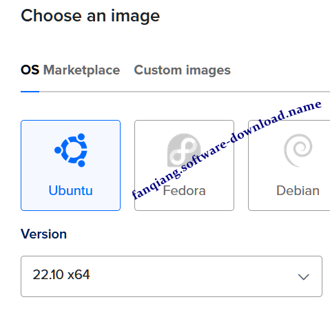
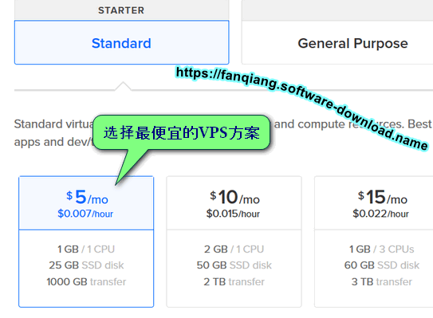
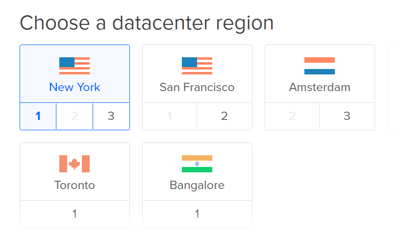
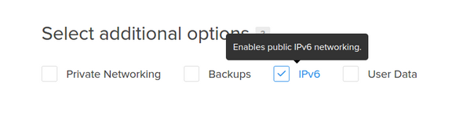
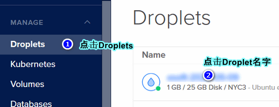
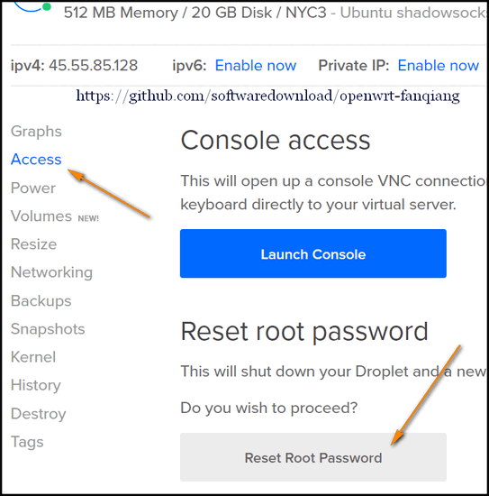
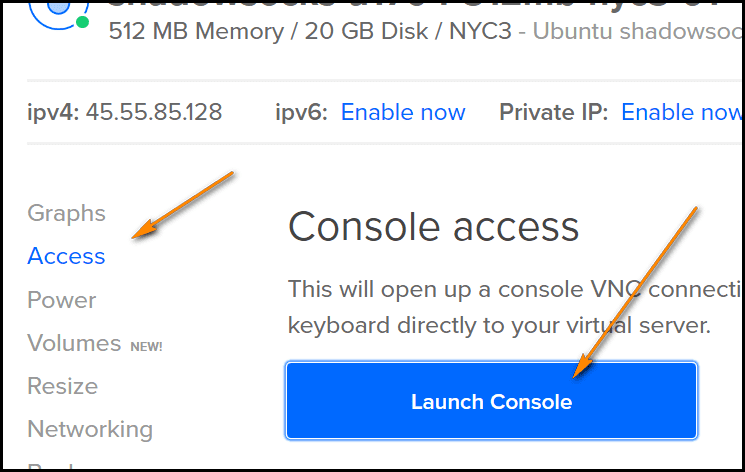

# 零起点DO VPS shadowsocks-libev 翻墙设置教程

## [Digital Ocean](https://www.digitalocean.com/?refcode=89497bd485e0) 的优点：
* 业界最有名的VPS服务商，服务有保障
* 全SSD硬盘，速度极快，重启在20秒内
* 所有VPS具有独立IP
* 费用极低，$5/月起
* 管理后台Console Access可以直接运行所有linux命令，可以不设置SSH
* 收费以小时计算，不用了可以删除，不会多收一分钱
* 更换IP方便，创建snapshot，再从snapshot新建Droplet,就可能得到新的IP了

### [立即点击这里注册DO](https://www.digitalocean.com/?refcode=89497bd485e0) 

## 创建翻墙用的虚拟服务器Droplet

注册DO并绑定支付方式后，登录管理后台，点击右上角的 `Create Droplet`:

- Choose an image 选择最新版的Ubuntu 64位，下图是14.04.3，下拉还有更新的如15.10：  
	
- Choose a site 一般512MB那款就够了：  
	
- Choose a datacenter region 选择San Francisco：  
		
- Select additional options, 勾选IPv6：  
	
- Choose a hostname, 只是助记，比如ubuntu-shadowsocks
- Create 创建虚拟服务器

## 进入DO VPS管理界面

在20秒内，VPS创建完毕，并自动分配了IP，点击VPS名字进入管理VPS管理界面：  

## 重置DO VPS Root密码:  

注：如果已经收到root密码，请跳到一下步

点击 `Reset Root Password` 重置密码：  

重置密码完成后，新的密码会发送到你的邮箱，下面我们就用这个密码登录并直接在网页上管理VPS

## 进入DO VPS命令行控制界面 Console Access

DO有个极为强大的功能，可以可以直接在管理后台Console Access 运行Linux命令管理VPS，相当于一个在线版的SSH:  

点击 `Console Access` 开启命令行窗口，如果打开失败就按F5刷新页面重试直到打开。

点击打开的命令行窗口以获得输入焦点。

## 命令行设置新的Root密码

开启DO Console Access后，输入root并回车，然后重新设置密码。

	Ubuntu 15.10 ubuntu-shadowsocks tty1
	ubuntu-shadowsocks login: root
	Passwd: 输入root密码
	You are required to change your password immediately (root enforced)
	Changing password for root.
	(Current) UNIX password: 输入root密码
	Enter new UNIX password: 输入新的root密码
	Retype UNIX password: 再次输入新的root密码
	
密码更新完成后更新一下系统：
	
	root@ubuntu-shadowsocks:~# apt-get update
	root@ubuntu-shadowsocks:~# apt-get dist-upgrade
 
可能会问你要不要更新一下grub，直接回车就行了。（我选择的是升级到 `install the package maintainer's version`）

## 从源码编译 shadowsocks-libev server

2016-01-19发现，shadowsocks.org网页无法打开，这给 `apt-get install` 方式安装shadowsocks-libev带来不便，不过我们可以自己从源码编译，很简单，而且随时可以编译到最新的版本。

Console Access界面是无法粘贴命令的，把下面命令逐行粘贴到浏览器地址栏，抄着输入也是很快的，输入第一行命令并回车后输入 y 安装所有相关包。

	root@ubuntu-shadowsocks:~# apt-get install build-essential autoconf libtool libssl-dev gawk debhelper dh-systemd init-system-helpers pkg-config git
	root@ubuntu-shadowsocks:~# git clone https://github.com/shadowsocks/shadowsocks-libev.git
	root@ubuntu-shadowsocks:~# cd shadowsocks-libev
	root@ubuntu-shadowsocks:~# dpkg-buildpackage -us -uc -i
	root@ubuntu-shadowsocks:~# cd ..
	root@ubuntu-shadowsocks:~# sudo dpkg -i shadowsocks-libev*.deb
	root@ubuntu-shadowsocks:~# ls /usr/bin/ss-*
	root@ubuntu-shadowsocks:~# ss-local ss-manager ss-redir ss-server ss-tunnel
	
## 设置 shadowsocks-libev server，见 [翻墙软件Shadowsocks-libev服务端设置](03.2.md)

至此，我们已经开通了DO VPS,并且在网页界面就安装完成了 shadowsocks-libev，下面是修改设置并重启shadowsocks-libev

	root@ubuntu-shadowsocks:~# vi /etc/shadowsocks-libev/config.json
	root@ubuntu-shadowsocks:~# service shadowsocks-libev restart
 
详细的设置教程在 [翻墙软件Shadowsocks-libev服务端设置](03.2.md)

再配置好客户端，如果没有错误，就可以成功翻墙了。所有以上过程2016-01-19亲测通过。

### 附录：怎样更换DO翻墙VPS的IP（或者怎样使用最省钱）

* 照上面教程创建Droplet ubuntu-shadowsocks, 设置好shadowsocks-libev服务端，其中server写 `0.0.0.0` 并测试通过
* Poweroff VPS，也就是VPS关机，这时还会产生VPS使用费用的，因为IP，空间等资源还是被你占用
* 创建Snapshot，命名为shadowsocks，并传送到你可能使用的各个区域。比如你原来是在San Francisco创建的，可以传送到New York区
* 删除VPS，Destroy Droplet ubuntu-shadowsocks，然后就不产生任何费用了。不怕麻烦，每天都这样操作，一个月可能只要2元钱就行了
* 下次要使用，在Create Droplet的第一步，Choose an image, 选择Snapshots, shadowsocks，其他和上面教程一样
* 从snapshot创建Droplet完成，页面显示了VPS的IP地址，shadowsocks客户端连接到这个IP地址就行了，服务端不用更改任何设置

### 附录：怎样不“登录”路由器更改OpenWrt shadowsocks-libev路由器的server IP

* 路由器设置密钥登录，这样ssh登录就不用密码了
* 创建config配置文件, Ubuntu下是 `~/.ssh/config`，增加如下内容：

		Host router
		    HostName 192.168.1.1
		    User root
		    Port 22
		    IdentityFile /path/to/your/rsa

	Windows下安装 git for Windows，选择使用OpenSSH，编辑 `C:\Program Files\Git\etc\ssh\ssh_config`

	然后就可以 `ssh router` 登录路由器了

* reset.sh:

		#!/bin/bash
		
		# Author: https://github.com/softwaredownload/openwrt-fanqiang
		# Date: 2016-01-20
		
		ssh router <<'ENDSSH'
		
		sed -ri "s/([0-9]{1,3}\.){3}[0-9]{1,3} /1.0.9.8 /" /usr/bin/shadowsocks-firewall
		sed -ri "s/([0-9]{1,3}\.){3}[0-9]{1,3}/1.0.9.8/" /etc/shadowsocks.json
		
		/etc/init.d/shadowsocks restart
		
		ENDSSH

	把reset.sh中的 `1.0.9.8` 改成shadowsocks服务端的server IP，然后运行 reset.sh就可以了。

	想要测试一下日本，英国，新加坡或美国的IP，so easy，2分钟就行了。	
	
	
#### Reference:
- https://github.com/shadowsocks/shadowsocks-libev