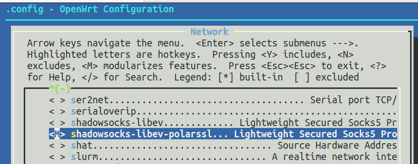

# 编译shadowsocks-libev for OpenWrt ipk安装包

网上也许没有适合自己路由器的shadowsocks-libev for OpenWrt ipk 安全包，即使有也不一定是最新源码编译的。自己动手自力更生是个好办法。

下面是在Ubuntu 64bit下编译shadowsocks-libev for OpenWrt ipk安装包的步骤：

## 安装依赖库，不同的操作系统版本可能要作相应调整
	sudo apt-get install build-essential subversion libncurses5-dev zlib1g-dev gawk gcc-multilib flex git-core gettext

## 下载OpenWrt源代码
	cd ~/Downloads
	git clone git://git.openwrt.org/openwrt.git

## 下载shadowsocks-libev源码

	cd ~/Downloads/openwrt
	pushd package
	git clone https://github.com/shadowsocks/shadowsocks-libev.git
	popd

或者：
	
	cd ~/Downloads/openwrt/package
	git clone https://github.com/shadowsocks/shadowsocks-libev.git
	

## 更新Feeds，使package在make menuconfig中可用，而不是真正安装或编译
	cd ~/Downloads/openwrt
	./scripts/feeds update -a
	./scripts/feeds install -a	
	make defconfig
	
## 先编译要用到的工具和库

	make prereq && make tools/install && make toolchain/install

等待时间较长，可以先和大妈一起去跳个广场舞，制造更多噪音恶心一下别人:)

## make menuconfig配置选项
	# 运行命令
	make menuconfig

有三个选项：
- y: 编译进固件
- m: 编译出安装包，但不打包进固件
- n: 排除
	

输入命令`make menuconfig`进入配置程序后：

- Target System: Atheros AR7xxx/AR9XXX  (Default value，不同的路由器，可能选择不同)
- Subtarget: Generic (Default value)
- Target Profile: TP-LINK TL-WR2543N/ND(因我们只是编译包，这步可以不选)
- Network, 选择shadowsocks-libev-polarssl,  按m设置为编译独立ipk安装包
- Save && Exit
			
  
图 make menuconfig

  
图　选择shadowsocks-libev-polarssl								
										
														
## 编译shadowsocks-libev for OpenWrt
	make V=99 package/shadowsocks-libev/openwrt/compile	
	
## 编译结果文件
输出文件是　openwrt/bin/ar71xx/packages/base/shadowsocks-libev-polarssl_1.4.6_ar71xx.ipk	

把文件scp复制到OpenWrt路由器/tmp，就可以　`opkg install shadowsocks-libev-polarssl_1.4.6_ar71xx.ipk`　安装了。
	
#### 参考：
- http://wiki.openwrt.org/doc/howto/buildroot.exigence
- http://wiki.openwrt.org/doc/howto/build
- https://github.com/shadowsocks/shadowsocks-libev
- http://sourceforge.net/projects/openwrt-dist/files/shadowsocks-libev/
- https://0066.in/archives/312
