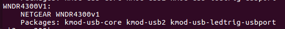

# 使用Image Builder编译自动翻墙OpenWrt固件

Image Builder又叫Image Generator，利用它我们可以方便地定制适合自己无线路由器的固件。

## 编译OpenWrt自定义翻墙固件的注意事项

* 不要用“root”用户编译
* 进入到编译系统目录中执行编译相关命令，如：~/Downloads/openwrt
* 在编译版的路径中不能够出现空格
* 如果已经用root用户下载并解压了源码，可用命令改属主成普通用户：sudo chown -R user:user ~/Downloads/openwrt

## 下载适合自己无线路由器的Image Builder

* 进入 http://downloads.openwrt.org/

* 选择Binary Releases或 Development Snapshots  
	- 目前的Binary Releases: http://downloads.openwrt.org/chaos_calmer/15.05/
	- Development Snapshots: http://downloads.openwrt.org/snapshots/trunk/

* 选择 CPU类型，如 ar71xx: http://downloads.openwrt.org/snapshots/trunk/ar71xx/

* 选择 Flash 类型, 如generic: http://downloads.openwrt.org/snapshots/trunk/ar71xx/generic/

下载命令举例:

	cd ~/Downloads
	wget http://downloads.openwrt.org/snapshots/trunk/ar71xx/generic/OpenWrt-ImageBuilder-ar71xx-generic.Linux-x86_64.tar.bz2
	tar -xjf  OpenWrt-ImageBuilder-ar71xx-generic.Linux-x86_64.tar.bz2

## 下载包含默认翻墙配置文件的openwrt-fanqiang项目

* git下载openwrt-fanqiang项目

	cd ~/Downloads
	git clone https://github.com/softwaredownload/openwrt-fanqiang

* 或者下载zip文件

	https://github.com/softwaredownload/openwrt-fanqiang/archive/master.zip

本地项目文件夹是： ~/Downloads/openwrt-fanqiang

## 复制openwrt-fanqiang里面的翻墙配置文件到openwrt-tlwr2543目录下

建立一个配置文件夹，以路由器型号结束，如 ~/Downloads/openwrt-tlwr2543。

	cd ~/Downloads
	mkdir openwrt-tlwr2543
	
	cd openwrt-fanqiang
	cp -R openwrt/default/* ~/Downloads/openwrt-tlwr2543/
	cp -R openwrt/tlwr2543/* ~/Downloads/openwrt-tlwr2543/
	
上面的操作，先复制共用的配置文件 openwrt/default/* 到 openwrt-tlwr2543目录下	
然后复制wr2543专用的配置文件(如果存在)到 openwrt/tlwr2543/* 到 openwrt-tlwr2543目录下，如果有同名文件就覆盖。

如果你要贡献本项目，也是先在openwrt-fanqiang/openwrt目录下先建立路由器型号为名称的文件夹，再把专用的配置文件放到此文夹下。注意文件夹和文件名都是小写的。

## 修改TL-WR2543路由器翻墙配置文件

### 主要修改以下文件：

	openwrt-tlwr2543/etc/shadowsocks.json
	openwrt-tlwr2543/usr/bin/shadowsocks-firewall
	openwrt-tlwr2543/etc/uci-defaults/defaults
	
为了方便以后升级，可以写个bash文件自动修改配置文件。

一切操作尽量自动化，你甚至可以自动化一切操作：下载ImageBuilder，下载OpenWrt源码，下载shadowsocks-libev源码，同步openwrt-fanqiang源码，编译ipk，修改翻墙设置，编译翻墙固件，早上一觉醒来，新鲜出炉、美味可口的翻墙固件就已经摆放在桌上了。

下面是一个自动修改配置文件的例子，从中可以知道需要修改哪些地方。从2015年12月起，可能用于自动化修改的默认值都应该标准化，方便自动化操作。

	#!/bin/bash
	
	# Author: https://github.com/softwaredownload/openwrt-fanqiang
	# Date:   2015-12-24
	
	REPOSITORY=~/Downloads/openwrt-fanqiang
	CONFIG=~/Downloads/openwrt-tlwr2543
	
	createdir() {
		rm -rf $CONFIG
		mkdir $CONFIG
	}
	
	copy() {
		cp -R $REPOSITORY/openwrt/default/* $CONFIG/
		cp -R $REPOSITORY/openwrt/tlwr2543/* $CONFIG/
	}
	
	setmod() {
		chmod +x $CONFIG/usr/bin/shadowsocks-firewall
		chmod +x $CONFIG/etc/uci-defaults
		chmod +x $CONFIG/etc/uci-defaults/*
	}
	
	modify() {
		# server ip address
		sed -i 's/1.0.9.8/server_ip/' $CONFIG/etc/shadowsocks.json
	
		# server_port
		sed -i 's/1098/server_port/' $CONFIG/etc/shadowsocks.json
		
		# local_port
		sed -i 's/7654/7654/' $CONFIG/etc/shadowsocks.json
	
		# password
		sed -i 's/killgfw/killgfw/' $CONFIG/etc/shadowsocks.json
	
		# method
		sed -i 's/aes-256-cfb/aes-256-cfb/' $CONFIG/etc/shadowsocks.json
	
	
		# server ip addresss
		sed -i 's/1.0.9.8/server_ip/' $CONFIG/usr/bin/shadowsocks-firewall
	
		# local_port
		sed -i 's/7654/7654/' $CONFIG/usr/bin/shadowsocks-firewall
	
	
		# ppoe username
		sed -i 's/wan-username/wan-username/' $CONFIG/etc/uci-defaults/defaults
	
		# ppoe password
		sed -i 's/wan-password/wan-password/' $CONFIG/etc/uci-defaults/defaults
	
		# wifi password
		sed -i 's/icanfly9876/icanfly9876/g' $CONFIG/etc/uci-defaults/defaults
	
		# root password
		sed -i 's/\\nfanqiang/\\nfanqiang/' $CONFIG/etc/uci-defaults/defaults
	}
		
	
	if [ "$1" = "createdir" ]; then
		createdir
	elif [ "$1" = "copy" ]; then
		copy
	elif [ "$1" = "setmod" ]; then
		setmod
	elif [ "$1" = "modify" ]; then
		modify
	else
	    echo "usage: createdir copy setmod modify"
	fi

**自动修改翻墙配置文件用法：**

	./config-tlwr2543.sh createdir
	./config-tlwr2543.sh copy
	./config-tlwr2543.sh setmod
	./config-tlwr2543.sh modify

## 确定OpenWrt无线路由器的PROFILE值
	cd OpenWrt-ImageBuilder-ar71xx-generic.Linux-x86_64
	make info

找到自己固件的型号，比如我的是 `TP-LINK TL-WR2543N/ND`,它的PROFILE值是TLWR2543。如下图：

## 找出默认应该包含进OpenWrt固件的包
对于TP-LINK WR2543无线路由器来说，可以这样获取：
	
	echo $(wget -qO - http://downloads.openwrt.org/snapshots/trunk/ar71xx/generic/config | sed -ne 's/^CONFIG_PACKAGE_\([a-z0-9-]*\)=y/\1/ip')

由于 OpenWrt开发非常活跃，不同版本的基础包可能是不同的。

2015-12-24的基础包：

> base-files busybox dnsmasq dropbear firewall fstools jsonfilter libc libgcc mtd netifd opkg procd swconfig ubox ubus ubusd uci usign kmod-ledtrig-usbdev kmod-lib-crc-ccitt kmod-nls-base kmod-ip6tables kmod-ipt-conntrack kmod-ipt-core kmod-ipt-nat kmod-nf-conntrack kmod-nf-conntrack6 kmod-nf-ipt kmod-nf-ipt6 kmod-nf-nat kmod-ipv6 kmod-ppp kmod-pppoe kmod-pppox kmod-slhc kmod-gpio-button-hotplug kmod-usb-core kmod-usb-ohci kmod-usb2 kmod-ath kmod-ath9k kmod-ath9k-common kmod-cfg80211 kmod-mac80211 libip4tc libip6tc libxtables libblobmsg-json libexpat libiwinfo libjson-c libnl-tiny libubox libubus libuci ip6tables iptables hostapd-common iw odhcp6c odhcpd ppp ppp-mod-pppoe wpad-mini iwinfo jshn libjson-script uboot-envtools

2014-09-01获取的基础包：

> base-files busybox dnsmasq dropbear firewall fstools jsonfilter libc libgcc mtd netifd opkg procd swconfig ubox ubus ubusd uci kmod-crypto-aes kmod-crypto-arc4 kmod-crypto-core kmod-ledtrig-usbdev kmod-lib-crc-ccitt kmod-nls-base kmod-ip6tables kmod-ipt-conntrack kmod-ipt-core kmod-ipt-nat kmod-ipt-nathelper kmod-ipv6 kmod-ppp kmod-pppoe kmod-pppox kmod-slhc kmod-gpio-button-hotplug kmod-usb-core kmod-usb-ohci kmod-usb2 kmod-ath kmod-ath9k kmod-ath9k-common kmod-cfg80211 kmod-mac80211 libip4tc libip6tc libxtables libblobmsg-json libiwinfo libjson-c libnl-tiny libubox libubus libuci ip6tables iptables hostapd-common iw odhcp6c odhcpd ppp ppp-mod-pppoe wpad-mini iwinfo jshn libjson-script uboot-envtools

默认包要包含在PACKAGES命令行参数中，并再加上必要的包：

	luci-ssl ipset wget shadowsocks-libev iptables-mod-nat-extra bind-dig

如果你的openWrt版本是 ATTITUDE ADJUSTMENT，可能加上iptables-mod-nat-extra包，如果没安装的话iptables的端口转发会不支持。

注意，在编译前要把 shadowsocks-libev 及其他要用到的 .ipk 文件放到ImageBuilder的目录下packages/base/：
	
	# 对于TLWR2543,DIR505A1:
	~/Downloads/OpenWrt-ImageBuilder-ar71xx-generic.Linux-x86_64/packages/base/
	
	# 对于WNDR4300:
	~/Downloads/OpenWrt-ImageBuilder-ar71xx-nand.Linux-x86_64/packages/base/

## OpenWrt Image Builder的三个命令行参数
- PROFILE	指定设备类型，此处是　TLWR2543
- PACKAGES	指定要编译进固件的包
- FILES		指定要编译进固件的自定义文件，如网络有关配置文件, ~/Downloads/openwrt-tlwr2543

## 开始编译OpenWrt自动翻墙固件
	cd ~/Downloads/OpenWrt-ImageBuilder-ar71xx-generic.Linux-x86_64
	make image PROFILE=TLWR2543 PACKAGES="base-files busybox dnsmasq dropbear firewall fstools jsonfilter libc libgcc mtd netifd opkg procd swconfig ubox ubus ubusd uci usign kmod-ledtrig-usbdev kmod-lib-crc-ccitt kmod-nls-base kmod-ip6tables kmod-ipt-conntrack kmod-ipt-core kmod-ipt-nat kmod-nf-conntrack kmod-nf-conntrack6 kmod-nf-ipt kmod-nf-ipt6 kmod-nf-nat kmod-ipv6 kmod-ppp kmod-pppoe kmod-pppox kmod-slhc kmod-gpio-button-hotplug kmod-usb-core kmod-usb-ohci kmod-usb2 kmod-ath kmod-ath9k kmod-ath9k-common kmod-cfg80211 kmod-mac80211 libip4tc libip6tc libxtables libblobmsg-json libexpat libiwinfo libjson-c libnl-tiny libubox libubus libuci ip6tables iptables hostapd-common iw odhcp6c odhcpd ppp ppp-mod-pppoe wpad-mini iwinfo jshn libjson-script uboot-envtools ipset wget shadowsocks-libev-polarssl luci-ssl" FILES=~/Downloads/openwrt-tlwr2543

编译好的的固件在ImageBuilder的bin/ar71xx/目录下。

	# 对于TLWR2543,DIR505A1:
	~/Downloads/OpenWrt-ImageBuilder-ar71xx-generic.Linux-x86_64/bin/ar71xx/
	
	# 对于WNDR4300:
	~/Downloads/OpenWrt-ImageBuilder-ar71xx-nand.Linux-x86_64/bin/ar71xx/
	
升级固件要用到的是 ...sysupgrade.bin，比如　openwrt-ar71xx-generic-tl-wr2543-v1-squashfs-sysupgrade.bin

然后把这个固件刷进TP-LINK WR2543N，重启路由器后后就能免设置智能翻墙。

## 刷翻墙固件后管理员登录OpenWrt

刷好固件并重启路由器后，电脑连上无线网络 eastking-tlwr2543, 然后就可用密码`fanqiang` 登录路由器。

- ssh登录openwrt管理路由器：  
		ssh root@192.168.1.1
- 浏览器打开192.168.1.1登录

以后玩OpenWrt出问题，可以重新刷上这个翻墙固件就又可以在网上畅行无阻了。

#### 参考：
- http://wiki.openwrt.org/doc/howto/obtain.firmware.generate
- https://wiki.openwrt.org/doc/howto/build
