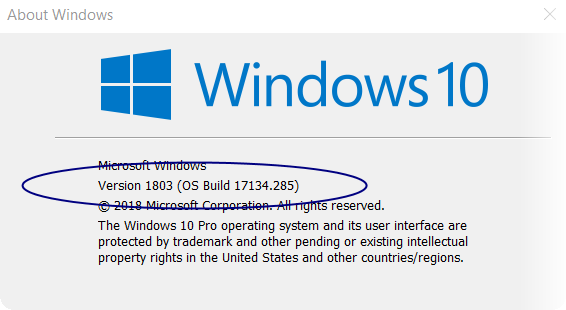
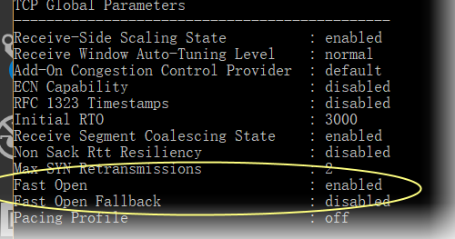
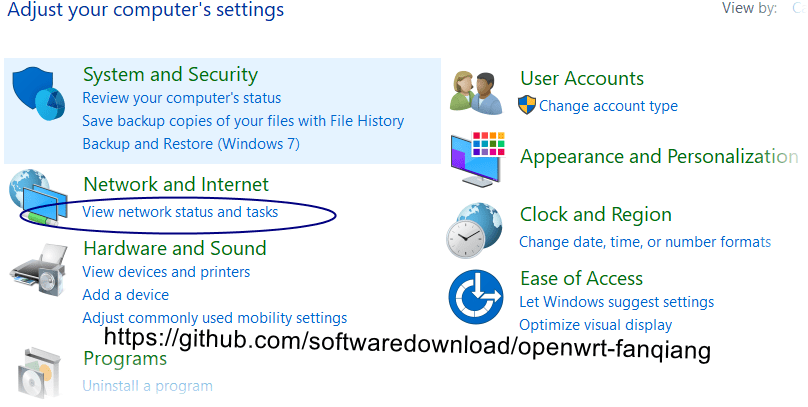
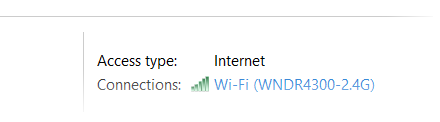
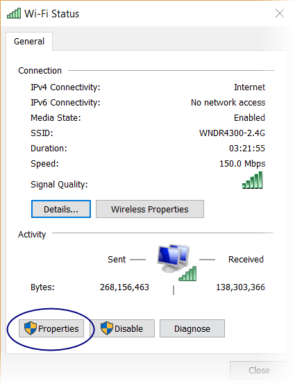
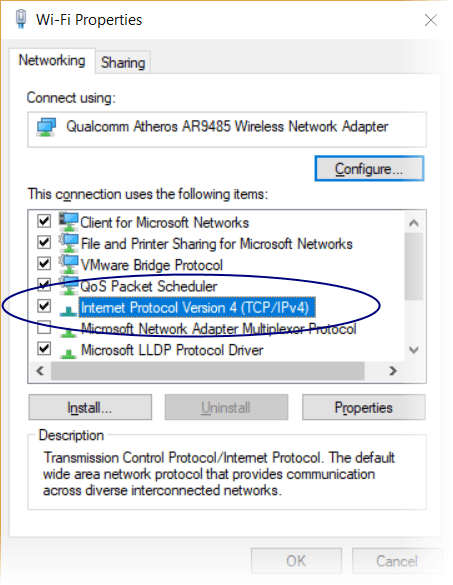
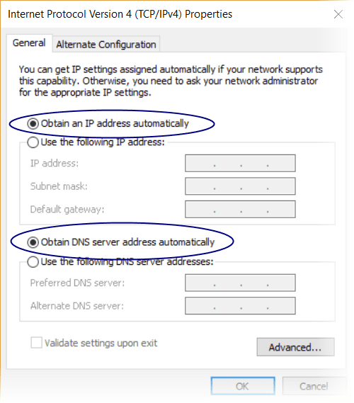

Windows PC翻墙最好方法：shadowsocks-libev + simple-obfs + TFO
=======================================

shadowsocks Windows客户端有哪些
-----------------------

Shadowsocks 有好几种Windows客户端:

- [Shadowsocks Windows](https://github.com/shadowsocks/shadowsocks-windows)
- [Shadowsocks QT5](https://github.com/shadowsocks/shadowsocks-qt5)
- Outline Google 开发，因为 Google 擅长收集个人隐私，不推荐使用

shadowsocks-libev 作为资源占用最少的 shadowsocks 实现，官方却不提供 Windows 预编译可执行文件下载，虽然他们知道 Windows 用户最多，但是开发者可能倾向于 Mac Linux 多一点，也就忽视了 Windows 用户的需求：Windows 用户如果有需要，可以自己修改编译，是不是

shadowsocks 官方建议大家在Windows下用 docker，一个 docker 社区版500多MB，如果是仅仅为了使用才丁点大的 shadowsocks-libev，有必要安装这么大的东东吗

还好 [cokebar](https://cokebar.info/archives/1988) 自己编译了 Windows 下的 shadowsocks-libev 和 simple-obfs，下面我们来看看怎么在 Windows PC 上用这两者翻墙

Windows 10 开启 TCP Fast Open
-------------------

下面的示范包含了 TFO，TFO要操作系统支持才行，因为翻墙软件要调用操作系统的API

请注意：

TCP Fast Open（TFO）仅适用于Windows 10, 1607或更高版本（精确地，build> = 14393）

怎么知道自己的 Windows 10的版本号？

按 Windows + R键，输入 `winver` 回车

上图显示版本1803，build 17134.285

如果您使用的是1709（内部版本16299）或更高版本，则还需要手动开启

- 按 Windows + X

- 选择 Command Prompt(Admin) - 打开控制台（管理员）

- 运行命令：

      netsh int tcp set global fastopenfallback=disabled

- 重启系统以后，验证 TFO 是否已经开启：

      netsh interface tcp show global

    其中 `fast open: enabled` 说明 TCP fast open 已经启用

    

下载 shadowsocks-libev simple-obfs Windows binary可执行文件
--------------------------------

https://software-download.name/2018/shadowsocks-libev-windows-binary-download/

我下载的是64位版本，并重命名为 ss-local.exe obfs-local.exe

[shadowsocks-libev + simple-obfs + TFO 服务端设置](04.5.md)
--------------------------

路由器 停止 shadowsocks-libev 翻墙服务
-----------------------------

如果你已经按照本教程设置了路由器翻墙，那么在测试 Windows PC 客户端翻墙前，首先要停止路由器里面的 shadowsocks-libev

    root@192.168.1.1
    kige@Openwrt:~# /etc/init.d/shadowsocks stop

更改网络连接设置
---------------

假设你的电脑是 WIFI 上网，原来通过路由器翻墙时，我们指定了WIFI连接的静态 IP，并把DNS设为路由器的内网 IP，现在要改成动态分配IP，自动获取DNS

- 按 Windows 键，输入 `control panel` 回车打开控制面板
- 选择 View ntetwork status and tasks

    

- 点击连上的 WIFI 连接

    

- 点击 Properties (属性)

    

- 点击 Internet Protocol Version 4(TCP/IPv4)

    

- 选择 Obtain an IP address automatically(自动获取IP地址), Obtain DNS server address automatically(自动获取DNS服务器地址)，OK(确认)

    

shadowsocks-libev + simple-obfs for Windows 客户端设置
----------------------------

更改网络连接设置后，确认能上国内网站，上不了 https://youtube.com

首先创建一个配置文件 shadowsocks.json

    {
        "server": "1.0.9.8",
        "server_port": 80,
        "password": "killgfw",
        "local_port": 7654,
        "method": "chacha20-ietf-poly1305",
        "timeout": 600,
        "fast_open": true,
        "plugin": "obfs-local",
        "plugin_opts": "obfs=http;obfs-host=32.kige.com;fast-open"
    }

这个配置文件其实和 [OpenWrt 路由器编译使用 Simple-obfs for shadowsocks-libev 混淆插件翻墙](04.7.md) 是一样的，默认把这个文件放在 ss-local.exe obfs-local 同一目录，这样写命令行时可以简短一些

其中 `"local_port": 7654` 指的是 ss-local 监听本机的 7654 端口，其他软件转发到这个端口的请求都由 ss-local 接收

Windows PC上用 shadowsocks-libev + simple-obfs + TFO 翻墙调试
------------------------

按 Windows + X，然后选择 Command Prompt 可以打开控制台，默认目录是 `C:\Users\your_name>` 可以用cd命令进入要操作的目录，或者把文件复制到 `C:\Users\your_name>` 下

Womdpws 10 修改相应设置后，按住 Shift 再在目录里右击，可以在当上目录打开控制台

建议安装 Git for Windows，安装时选择 OpenSSH，然后在任何目录右击，可以打开当前目录的控制台，这个控制台的操作习惯和 Linux 类似，另外可以和 Linux 下一样的方式操作 ssh

先打印一下 ss-local 的命令行选项，如果我们用了无效的选项，ss-local 会直接退出

    C:\shadowsocks-libev\64> ss-local -h
    shadowsocks-libev 3.2.0
    maintained by Max Lv and Linus Yang

    usage:

    ss-local

    -s <server_host>           Host name or IP address of your remote server.
    -p <server_port>           Port number of your remote server.
    -l <local_port>            Port number of your local server.
    -k <password>              Password of your remote server.
    -m <encrypt_method>        Encrypt method: rc4-md5,
        aes-128-gcm, aes-192-gcm, aes-256-gcm,
        aes-128-cfb, aes-192-cfb, aes-256-cfb,
        aes-128-ctr, aes-192-ctr, aes-256-ctr,
        camellia-128-cfb, camellia-192-cfb,
        camellia-256-cfb, bf-cfb,
        chacha20-ietf-poly1305,
        xchacha20-ietf-poly1305,
        salsa20, chacha20 and chacha20-ietf.
        The default cipher is chacha20-ietf-poly1305.

    [-a <user>]                Run as another user.
    [-f <pid_file>]            The file path to store pid.
    [-t <timeout>]             Socket timeout in seconds.
    [-c <config_file>]         The path to config file.
    [-i <interface>]           Network interface to bind.
    [-b <local_address>]       Local address to bind.

    [-u]                       Enable UDP relay.
    [-U]                       Enable UDP relay and disable TCP relay.

    [--reuse-port]             Enable port reuse.
    [--fast-open]              Enable TCP fast open.
    with Linux kernel > 3.7.0.
    [--acl <acl_file>]         Path to ACL (Access Control List).
    [--mtu <MTU>]              MTU of your network interface.
    [--no-delay]               Enable TCP_NODELAY.
    [--key <key_in_base64>]    Key of your remote server.
    [--plugin <name>]          Enable SIP003 plugin. (Experimental)
    [--plugin-opts <options>]  Set SIP003 plugin options. (Experimental)

    [-v]                       Verbose mode.
    [-h, --help]               Print this message.

然后在命令行输入：

    ss-local -c shadowsocks.json -v

注意，我们启用了 `-v` 以在控制台打印出活动记录，这在调试时十分有用，调试完成后可以去掉这个选项

控制台显示类似下面的信息：

    C:\shadowsocks-libev\64> ss-local -c shadowsocks.json -v
    2018-10-01 11:28:48 INFO: plugin "obfs-local" enabled
    2018-10-01 11:28:48 INFO: using tcp fast open
    2018-10-01 11:28:48 INFO: initializing ciphers... chacha20-ietf-poly1305
    2018-10-01 11:28:48 INFO: listening at 127.0.0.1:7654
    2018-10-01 11:28:48 [simple-obfs] INFO: using tcp fast open
    2018-10-01 11:28:48 [simple-obfs] INFO: obfuscating enabled
    2018-10-01 11:28:48 [simple-obfs] INFO: obfuscation http method: GET
    2018-10-01 11:28:48 [simple-obfs] INFO: obfuscating hostname: 32.kige.com
    2018-10-01 11:28:48 [simple-obfs] INFO: listening at 127.0.0.1:57373

显示 ss-local 启用了 obfs-local 插件，应用了 tcp fast open, 并监听在本机 7654 端口。obfs-local 应用了 tcp fast open，应用了混淆，并监听在本机随机端口和 ss-local 通信

这时我们打开浏览器，能翻墙吗？显然不能，因为浏览器并不知道 ss-local 监听在本机 7654端口，更不会把请求发送到那里，怎么可能翻墙呢

设置 Chrome 浏览器翻墙
------------------------

接下来我们得告诉浏览器把请求转发到 本机 7654 端口

假设你已经安装了 Chrome 浏览器

- 按 Windows 键，输入 chrome，在出来的 Google Chrome 图标上点右键
- 选择 `Open File Location` 打开文件所在位置
- 这时会打开 Chrome 快捷方式所在文件夹，并默认选中，Ctrl + C 复制
- 来到桌面，Ctrl + V 粘贴，把刚粘贴的快捷方式重命名为 Proxy
- 在 Proxy 图标上右击，选 Properties 属性
- 在 Target （目标）后面加一个英文空格，再加上下面的内容：

      --proxy-server=socks5://127.0.0.1:7654

    

设置好以后，退出已经打开的 Chrome，点击这个 Proxy(Chrome)，然后 浏览 https://youtube.com

如果设置都正确，应该翻墙无障碍了。这是本浏览器内全局翻墙，不区分国内、国外 IP，挺好，否则打开有些外网会很慢或者根本打不开

这时 DNS 是谁在解析呢？我们曾在 OpenWrt 路由器里设置 ss-tunnel 把域名解析请求发送到 shadowsocks 服务端，服务端把解析结果返回到客户端，从而避免了域名污染

客户端用 ss-local 的时候，由 ss-local 自动把域名解析请求发送到服务端了，不需要我们干预。在路由器里也可以用 ss-local  来代替 ss-redir + ss-tunnel + dnsmasq 三者，不过这样的话国内域名的解析也发到了服务端，浏览国内网站会有一些延迟

Windows PC 浏览器翻墙最佳方法总结
--------------------------

- 设置 ss-local 随机启动
- 桌面放二个 Chrome 图标，一个重名为 Proxy 用来翻墙，另一个命名为 Chrome不翻墙
- 浏览外网，关闭打开的 Chrome，再运行 Proxy
- 浏览内网，关闭打开的 Proxy，再运行 Chrome
- 广告屏蔽可以用 host 文件和浏览器插件

shadowsocks-libev + simple-obfs 占用资源极少，电脑随机启动占用的资源可以忽略不计

本文所述方法是Windows PC浏览器翻墙最佳方法，适合主要用浏览翻墙的用户。如果是路由器翻墙，如果打开较多网页，路由器计算资源有限，会有压力

如果电脑有较多的需要翻墙的软件，需要分别设置代理地址，稍显麻烦，路由器翻墙会比较方便

**相关资源**:

- https://github.com/shadowsocks/simple-obfs/releases/
- [Shadowsocks-libev, simple-obfs for Windows 下载 (支持TFO)](https://software-download.name/2018/shadowsocks-libev-windows-binary-download/)
- [Shadowsocks-libev, simple-obfs for Windows 下载 (不支持TFO)](https://github.com/DDoSolitary/shadowsocks-libev-win)
- https://fanqiang.software-download.name/