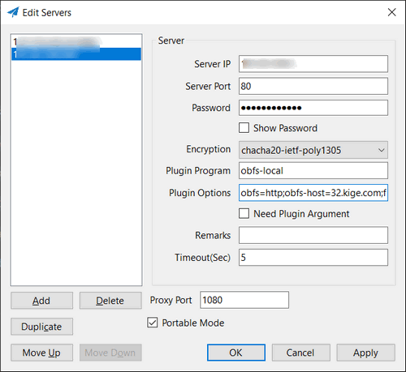

Windows shadowsocks 客户端配置 simple-obfs 翻墙
=======================================

在 Windows 上使用 Shadowsocks 客户端翻墙时，在有的地区如果不用插件，那么翻墙可能被干扰。本文就说一下 Windows 上 Shadowsocks 和 Simple-obfs 混淆插件的配合使用

下载 [Shadowsocks Windows](https://github.com/shadowsocks/shadowsocks-windows) 客户端
-----------------------

下载 [simple-obfs Windows](https://software-download.name/2018/shadowsocks-libev-windows-binary-download/)
----

把 **64/ss-local.exe** 或 32/ss-local.exe 放到 Shadowsocks.exe 同目录，注意，是 ss-local.exe 和 Shadowsocks.exe 同目录

我是 Windows 10，用的是 64/ss-local.exe

配置 Shadowsocks Windows
----

假设你的Windows 系统已经开启了 Fast Open

- 服务器端口(Server Port)：**80**
- 插件程序(Plugin Program)： **ss-local**
- 插件选项(Plugin Options)： **obfs=http;obfs-host=32.kige.com;fast-open**

把 **32.kige.com** 换成你实际使用的域名

**相关资源**:

- [Linux 服务器安装 Simple-obfs 混淆插件](https://fanqiang.software-download.name/ebook/04.5.html)
- [Simple Obfs 混淆插件的工作原理](https://fanqiang.software-download.name/ebook/04.6.html)
- [OpenWrt 路由器使用 Simple Obfs混淆插件](https://fanqiang.software-download.name/ebook/04.7.html)
- [Windows翻墙最好方法：shadowsocks-libev + simple-obfs + TFO教程](https://fanqiang.software-download.name/ebook/04.8.html)
- <https://github.com/shadowsocks/simple-obfs>
- [Shadowsocks-libev, simple-obfs for Windows 下载 (不支持TFO)](https://github.com/DDoSolitary/shadowsocks-libev-win)
- <https://fanqiang.software-download.name/>