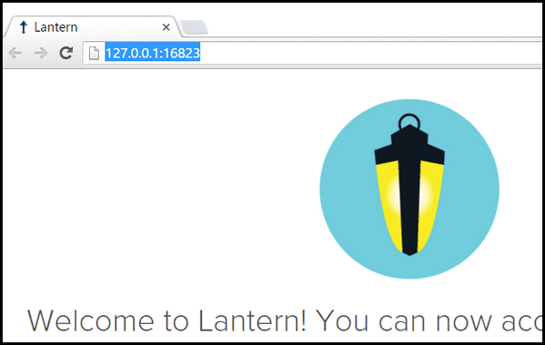
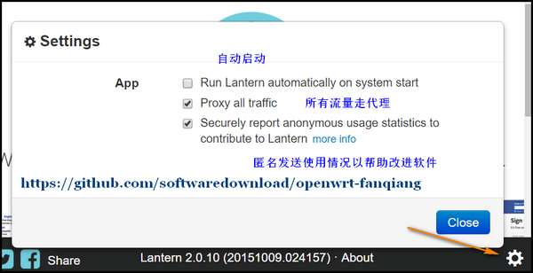
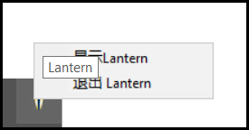
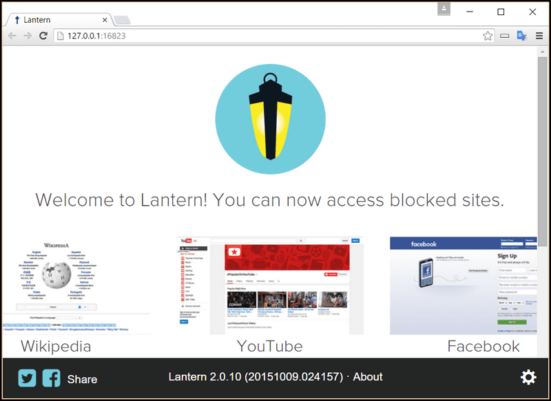

# 利用lantern 蓝灯实现浏览器自动翻墙教程

蓝灯运用了多种技术，通过未被屏蔽的用户转发流量实现浏览器全自动翻墙。

## latern蓝灯和 OpenWrt shadowsocks翻墙的区别

- 蓝灯主要是浏览器自动翻墙
- [路由器OpenWrt shadowsocks翻墙方案](https://github.com/softwaredownload/openwrt-fanqiang) 是所有接入的设备都自动翻墙,可定制性更高

## 为什么选择 lantern 蓝灯翻墙

有很多的翻墙软件，有闭源的，也有开源的，我们优先选择开源软件。闭源软件缺少外界监督，不能保证没有问题。

蓝灯就是优秀的开源翻墙软件。今天是2016-01-10，在Github上已经 6516 Star, 2228 Fork，开发很活跃。

## 下载 lantern蓝灯翻墙软件

Github下载：  
https://github.com/getlantern/lantern

主页下载:  
https://getlantern.org/

## 蓝灯翻墙软件安装和设置

- 停止路由器的shadowsocks翻墙  
	登陆OpenWrt路由器，运行命令:  
		/etc/init.d/shadowsocks stop  
	如果你是按照　[https://github.com/softwaredownload/openwrt-fanqiang](https://github.com/softwaredownload/openwrt-fanqiang) 设置的翻墙，那么还得检查一下 [/etc/init.d/shadowsocks](https://github.com/softwaredownload/openwrt-fanqiang/blob/master/openwrt/default/etc/init.d/shadowsocks) 里的start, stop函数是否正确。2016-01-10前这两个函数有bug，导致执行stop后上网不正常。
	
- 打开 [Chrome浏览器](https://www.google.com/chrome/browser/desktop/)

- 安装或运行lantern蓝灯，会自动在Chrome里打开新的页面，地址栏显示了翻墙转发的地址和端口，比如 `http://127.0.0.1:16823/`  
	
	
- 点击打开页面的右下角的齿轮图标设置lantern翻墙配置:  
	  
	
- 右键点击电脑右下角托盘图标退出lantern(Windows 为例)  
	  
		
如果一切正常，一运行蓝灯，就可以点击蓝灯新打开的页面上的 YouTube 图标看视频了，非常方便。

 