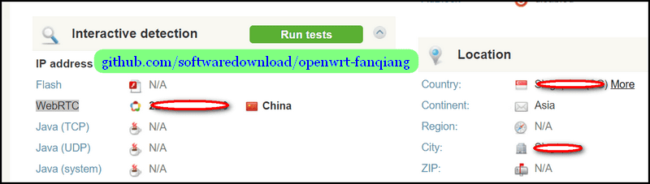
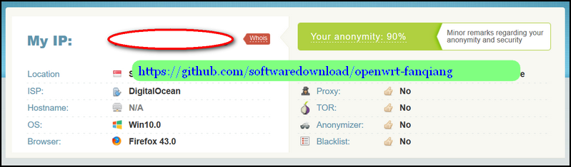
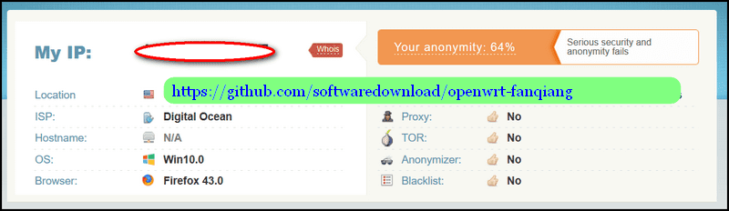
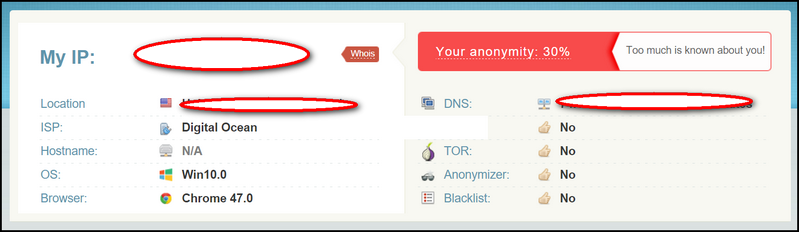

# 怎样加强上网的匿名性

即使翻墙上网了，真实的上网信息，如本机IP地址，系统语言,系统时区等等还是可能暴露。

## 怎样检查翻墙后浏览器上网的匿名性

访问下面网站检查自己的匿名程度：

### [https://whoer.net/#extended](https://whoer.net/#extended)

## 蓝灯翻墙，浏览器匿名程度测试

下图，蓝灯翻墙，Chrome浏览器，匿名程度 40%，很差:  

再拉下去看，WebRTC暴露了本机IP地址：  

下图，蓝灯翻墙，FireFox浏览器，开启隐私设置后WeRTC已经关闭，匿名程度高达90%：  

## 路由器刷OpenWrt，安装shadowsocks-libev翻墙，浏览器匿名程度测试

下图，FireFox浏览器，同样设置，WeRTC已经关闭，匿名程度64%：  

Chrome浏览器，匿名程度只有30%了：  

## 防止浏览器 WebRTC 泄露本机IP地址:

Chrome浏览器安装插件就可以了： WebRTC Leak Prevent

安装以后，路由器刷OpenWrt，安装shadowsocks-libev翻墙，Chrome浏览器的匿名程度提升到了64%

### 什么是WebRTC What is WebRTC:

WebRTC，名称源自网页实时通信（Web Real-Time Communication）的缩写，是一个支持网页浏览器进行实时语音对话或视频对话的技术，是谷歌2010年以6820万美元收购Global IP Solutions公司而获得的一项技术。

WebRTC实现了基于网页的视频会议，标准是WHATWG 协议，目的是通过浏览器提供简单的javascript就可以达到实时通讯（Real-Time Communications (RTC)）能力。

WebRTC（Web Real-Time Communication）项目的最终目的主要是让Web开发者能够基于浏览器（Chrome\FireFox\...）轻易快捷开发出丰富的实时多媒体应用，而无需下载安装任何插件，Web开发者也无需关注多媒体的数字信号处理过程，只需编写简单的Javascript程序即可实现，W3C等组织正在制定Javascript 标准API，目前是WebRTC 1.0版本，Draft状态；另外WebRTC还希望能够建立一个多互联网浏览器间健壮的实时通信的平台，形成开发者与浏览器厂商良好的生态环境。同时，Google也希望和致力于让WebRTC的技术成为HTML5标准之一，可见Google布局之深远。[1] 
WebRTC提供了视频会议的核心技术，包括音视频的采集、编解码、网络传输、显示等功能，并且还支持跨平台：windows，linux，mac，android。
