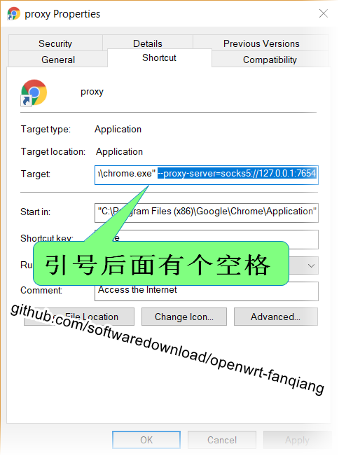

# 简单、高速、稳定的翻墙软件 overtls 安装、使用教程

[overtls](https://github.com/ShadowsocksR-Live/overtls) 是 目前较新的 SOCKS5 型代理软件，在软件内部通过 TLS 实现数据传输，同时支持 TCP 和 UDP 流量转发

overtls 也可能是目前设计最简洁、使用最简单的翻墙软件

因为 GFW 不可能封锁用于互联网传输数据的 TLS 协议，overtls 就用 TLS 传输数据。又因为 TLS 是一种加密协议，所以，GFW 不知道协议传送的数据内容

当用户浏览某个网址如 `https://claude.ai` 时， overtls 客户端会访问我们在配置文件里约定的资源 uri，如 `https/domain.com/zyxwvutsrqponmlkjih/`，overtls 服务端会向浏览器返回用户想看的内容


## 安装 overtls 的准备工作
- 一个带公网 IP 的 VPS 主机，必须自行购买
- 一个域名，可以购买或申请免费的，并将该域名解析到 VPS 主机的 IP 上

  可以是主域名，如 `domain.com`，也可以是子域名，如 `american.domain.com`

- 一对 https 证书/私钥，证书可以自行购买，也可以在 Let's Encrypt 申请免费的
- 一个 http 服务端软件（如 nginx ），并提供用于伪装用途的站点资源或者充当前置的反向代理

## Nginx 翻墙专用子域名设置

如果你已经在用一个具有 https 证书的主域名，再在 Nginx 里设置一个子域名用于 overtls 是非常简单的，下面是示例代码，注意，要把个性化内容修改成实际值

```shell
server {
	server_name american.domain.com;
	root /home/name/public/american/;
	index index.html index.htm;

    listen [::]:443;
    listen 443 ssl;
    ssl_certificate /etc/letsencrypt/live/american.domain.com/fullchain.pem;
    ssl_certificate_key /etc/letsencrypt/live/american.domain.com/privkey.pem;
}
```

修改设置后，重启 Nginx 以使修改生效：
```shell
sudo nginx -s reload
```

## Ubuntu server 命令行安装 Overtls 服务端

```shell
wget https://raw.githubusercontent.com/shadowsocksr-live/overtls/master/install/overtls-install-musl.sh
chmod +x overtls-install-musl.sh
 sudo ./overtls-install-musl.sh
 ```

---

 ```shell
 ...自动检查环境，安装依赖
请输入 你的网站域名 (形如 mygooodsite.com)
Please enter your domain name (for example: mygooodsite.com): american.domain.com
[OK]  正獲取公網 IP, 請耐心等待...
[OK]  Obtaining public IP information, please wait patiently...
DNS resolution IP: ...
Local V4 IP: ...
Local V6 IP: ...
[OK]  The DNS resolution IP matches local V4 IP
请输入 反向代理入口路径(不带前后斜杠), 默认值 zyxwvutsrqponmlkjih
Please enter reverse proxy path without slashes (default zyxwvutsrqponmlkjih): （注：可回车使用默认值）
请输入 站点端口号 (默认值 443)
Please enter the access port number (default: 443):（注：可回车使用默认值）
Failed to stop overtls.service: Unit overtls.service not loaded.
Failed to disable unit: Unit file overtls.service does not exist.
overtls uninstall success!
[OK]  nginx has been installed before this moment
[OK]  [nginx] copy files Completed
[OK]  [CA] Create account key Completed
[OK]  [CA] Create CSR file Completed
Parsing account key...
Parsing CSR...
Found domains: american.domain.com
Getting directory...
Directory found!
Registering account...
Registered! Account ID: ...
Creating new order...
Order created!
Verifying american.domain.com...
american.domain.com verified!
Signing certificate...
Certificate signed!
[OK]  [CA] Obtain website certificate Completed
--2024-08-22 06:03:15--  ...
Resolving letsencrypt.org (letsencrypt.org)...
Connecting to letsencrypt.org (letsencrypt.org)|2600:1f1c:471:9d01::c8|:443... connected.
HTTP request sent, awaiting response... 200 OK
Length: 1647 (1.6K) [application/x-pem-file]
Saving to: ‘STDOUT’

2024-08-22 06:03:15 (21.8 MB/s) - written to stdout [1647/1647]

[OK]  [CA] Merger of intermediate certificate and website certificate Completed
--2024-08-22 06:03:16--  ...
Resolving letsencrypt.org (letsencrypt.org) ...
Connecting to letsencrypt.org (letsencrypt.org)|...|:443... connected.
HTTP request sent, awaiting response... 200 OK
Length: 1939 (1.9K) [application/x-pem-file]
Saving to: ‘STDOUT’

[OK]  [CA] Root certificate and intermediate certificate merge Completed
[OK]  [CA] Certificate configuration Completed
no crontab for root
[OK]  cron scheduled task update Completed
/etc/init.d/overtls starting...
Synchronizing state of overtls.service with SysV service script with /lib/systemd/systemd-sysv-install.
Executing: /lib/systemd/systemd-sysv-install enable overtls
Created symlink /etc/systemd/system/multi-user.target.wants/overtls.service → /lib/systemd/system/overtls.service.
```

### 保存自动生成的 overtls 配置文件 config.json

最后，自动安装程序会在命令行屏幕给出直接可用的配置文件，类似下面：


======== config.json ========

```json
{
    "remarks": "login-name-mark",
    "tunnel_path": "/zyxwvutsrqponmlkjih/",
    "test_timeout_secs": 5,

    "server_settings": {
        "forward_addr": "http://127.0.0.1:80",
        "listen_host": "127.0.0.1",
        "listen_port": 3210
    },

    "client_settings": {
        "server_host": "20.19.18.17",
        "server_port": 443,
        "server_domain": "american.domain.com",
        "listen_host": "127.0.0.1",
        "listen_port": 7654
    }
}
```

复制屏幕上的配置，保存到本机为 `config.json`

另外，屏幕上还显示 ssr，类似下面：

```
ssr://...
```

把这行内容保存到本机

可以把屏幕上显示的 QR code 图片也保存到本机

### 检查服务端 overtls 是否在运行：

```shell
ps ax | grep overtls
 9840 ?        Sl     0:00 /usr/local/bin/overtls -d -r server -c /etc/overtls/config.json
```

上面显示 overtls 正在运行

### Ubuntu server 服务端控制 overtls 的运行

```shell
# 停止 overtls
sudo systemctl stop overtls
# 启动 overtls
sudo systemctl start overtls
# 重启
sudo systemctl restart overtls
```


## 命令行运行 overtls 科学上网教程

### Windows 本机安装 Overtls 命令行软件

overtls 下载页面:

<https://github.com/ShadowsocksR-Live/overtls/releases>

2024-08-22 的下载链接：

<https://github.com/ShadowsocksR-Live/overtls/releases/download/v0.2.33/overtls-i686-pc-windows-msvc.zip>


### 创建日志文件

在工作目录里执行命令创建 `.env 文件`，在 Msys bash 里是这样：

```
touch .env
```

可以通过这个文件查看软件的运行日志

### 命令行运行 overtls

我在 Windows 安装了 Msys Bash，用下面命令运行 overtls

```
./overtls.exe -r client -c ./config.json
```

### 设置 Chrome 浏览器翻墙

接下来我们得告诉浏览器把请求转发到 本机 7654 端口

假设你已经安装了 Chrome 浏览器

- 按 Windows 键，输入 chrome，在出来的 Google Chrome 图标上点右键
- 选择 `Open File Location` 打开文件所在位置
- 这时会打开 Chrome 快捷方式所在文件夹，并默认选中，Ctrl + C 复制
- 来到桌面，Ctrl + V 粘贴，把刚粘贴的快捷方式重命名为 `Proxy`
- 在 Proxy 图标上右击，选 Properties 属性
- 在 Target （目标）后面加一个英文空格，再加上下面的内容：

      --proxy-server=socks5://127.0.0.1:7654

    

设置好以后，退出已经打开的 Chrome，点击这个 Proxy(Chrome)，然后 浏览 https://youtube.com

如果设置都正确，应该翻墙无障碍了。这是本浏览器内全局翻墙，不区分国内、国外 IP，挺好，否则打开有些外网会很慢或者根本打不开

我们可以让 overtls 随机启动，想翻墙时就用刚才创建的快捷方式打开浏览器

## 用 overtls GUI 软件科学上网

如果你觉得命令行运行 overtls 稍有不便，那么可以试试 GUI 界面

### 下载 overtls 的 GUI 程序 ssrWin

ssrWin 下载页面：

<https://github.com/ShadowsocksR-Live/ssrWin/releases>

2024-08-22 的具体下载链接:

<https://github.com/ShadowsocksR-Live/ssrWin/releases/download/v0.8.9/ssr-win-x64.zip>

下载时可能报毒，这时需要设置一下才能下载

运行方法：

- 运行 `ssrWin.exe`
- 从 `ssr` 导入翻墙配置
  - 复制服务器安装 overttls 结束时显示的 ssr 字符串
  - 在 ssrWin 托盘图标点右键，选择 `import URL from clipboard`
  - 如果你修改了 `config.json`，可用 overtls 命令行程序重新生成 ssr：`overtls -c config.json -g`
- 也可以从 QR 图片导入配置
  - 把服务器安装 overttls 结束时显示的二维码图片截屏，并复制到内存
  - 在 ssrWin 托盘图标点右键，选择 `Scan QR code from screen`
- 在 ssrWin 托盘图标的右键菜单里选择 `Run`
- 如果想要停止翻墙，就在 ssrWin 托盘图标点右键，选择 `Stop`

ssrWin 的配置文件是 `settings.json`，退出 ssrWin 后，修改此文件，再启动 ssrWin 就可以使修改生效。如果想要在另一台 Windows 设备使用 ssrWin，只要把 `settings.json` 复制过去覆盖默认的文件，再启动 ssrWin.exe 就可以翻墙上网了，非常方便

如果配置了多个 overtls 服务端站点，可以都导入 ssrWin 并在其托盘图标的右键菜单中选择站点

然后可以点开 Chrome, Firefox, IE 或 其它浏览器翻墙了，这时已经修改了系统的代理设置， 不用特别在浏览器内部安装代理插件，已经安装的代理插件也请禁用或停用或卸载掉，否则有可能适得其反上不了网

2024-08-26 注：ssrWin 托盘图标有时会失去响应


### VPS 安装 overtls 翻墙的注意事项

安装前建议阅读 overtls 的服务端自动安装脚本 [overtls-install-musl.sh](https://github.com/ShadowsocksR-Live/overtls/blob/master/install/overtls-install-musl.sh)

有些事情必须注意，比如，安装脚本会删除 nginx/sites-enabled 目录：

```shell
rm -rf /etc/nginx/sites-enabled
```

同时也会删除 site_dir

安装脚本会在服务器上创建文件：

> /etc/nginx/conf.d/overtls.conf

这个文件设置了反向代理，并设置为 `defautl_server`

如果你的 VPS 并不仅仅是用来翻墙，同 IP 下还有其他网站，并在某个正在使用的域名下设立了一个 overtls 翻墙专用的子域名，如 `american.domain.com`，那么建议做如下操作

- 设置` defalut_server`

  `overtls.conf` 里已经设置了 `default_server`，那么 `/etc/nginx/sites-available/` 目录下的网站配置文件里，不能再设置 `defalut_server`

- 删除 `/etc/nginx/sites-available/domain.com` 里子域名 `american.domain.com` 的配置，否则和 `overtls.conf` 重复了
- 重新生成 `/etc/nginx/sites-enabled` 下的文件:

  ```shell
  cd /etc/nginx/sites-enabled
  sudo ln -ns ../sites-enabled/domain.com
  ```

- 重启服务，以使修改生效

  ```shell
  sudo nginx -s reload
  sudo systemctl restart overtls
  ```

注意，如果 打开 `https://american.domain.com` 页面显示不是安全链接，则可能需要更新证书

#### /etc/nginx/conf.d/overtls.conf 的默认内容，类似如下

```shell
    server {
        listen 443 ssl default_server;
        listen [::]:443 ssl default_server;
        ssl_certificate       /fakesite_cert/chained_cert.pem;
        ssl_certificate_key   /fakesite_cert/private_key.pem;
        ssl_protocols         TLSv1 TLSv1.1 TLSv1.2;
        ssl_ciphers           HIGH:!aNULL:!MD5;
        server_name           american.domain.com;
        index index.php index.html index.htm index.nginx-debian.html;
        root  /fakesite;
        error_page 400 = /400.html;

        location ~ \.php$ {
            # include snippets/fastcgi-php.conf;
            # fastcgi_pass unix:/run/php/php7.4-fpm.sock;
        }

        location /zyxwvutsrqponmlkjih/ {
            proxy_redirect off;
            proxy_pass http://127.0.0.1:10987;
            proxy_http_version 1.1;
            proxy_set_header Upgrade $http_upgrade;
            proxy_set_header Connection "upgrade";
            proxy_set_header Host $http_host;
        }
    }

    server {
        listen 80 default_server;
        listen [::]:80 default_server;
        server_name american.domain.com;
        index index.php index.html index.htm index.nginx-debian.html;
        root  /fakesite;

        location /.well-known/acme-challenge/ {
        }

        location / {
            # rewrite ^/(.*)$ https://american.domain.com:443/ permanent;
        }
    }
```

## overtls 开启 HTTP/2 加速网络连接

随着 Web 应用程序的发展，性能考虑因素变得更加重要。HTTP/2 是超文本传输协议的第二个主要版本，旨在解决 HTTP/1.x 的一些缺点并提高 Web 通信的性能。它最重要的增强功能之一是通过标头压缩、通过单个连接多路复用多个请求以及服务器推送功能等功能减少延迟。对于像 Nginx 这样的 Web 服务器，启用 HTTP/2 可以显著改善页面加载时间和整体用户体验

overtls 的默认设置并没有开启 HTTP/2，这时就会有连接错误。左键单击 ssrWin 的托盘图标可以查看运行日志，这时你可能会发现有时会出现红色字体行，其中有“http2socks”字样，表示 http2 连接失败

下面是 Ubuntu server 开启 HTTP/2 的步骤：

- 修改 `/etc/nginx/conf.d/overtls.conf`，相关行修改后如下：

   ```nginx
   listen [::]:443 ssl http2;
   listen 443 ssl http2;
   ```

- 移除旧的密码套件

   如果你的网站配置文件 `/etc/nginx/sites-enabled/domain.com` 中有如下语句，请把它注释掉：

   ```nginx
   # include /etc/letsencrypt/options-ssl-nginx.conf; # managed by Certbot
   ```

- 增加新的安全密码套件

   在 `/etc/nginx/nginx.conf` 的 `http` 块增加设置：

   ```nginx
   ssl_ciphers EECDH+CHACHA20:EECDH+AES128:RSA+AES128:EECDH+AES256:RSA+AES256:EECDH+3DES:RSA+3DES:!MD5;
   ```

  也可以改成修改网站配置文件

- 验证 HTTP/2 是否成功开启

   验证 nginx 配置是否正确：
   ```
   sudo nginx -t
   sudo systemctl restart nginx
   ```

   验证 HTTP/2 是否在工作：

   ```bash
   curl -I -L --http2 https://domain.com
   ```

   如果显示类似下面的信息，说明万事大吉：

   ```plaintext
   HTTP/2 200
   server: nginx
   date: Wed, 04 Sep 2024 06:37:48 GMT
   content-type: text/html
   content-length: 234440
   last-modified: Tue, 03 Sep 2024 13:47:25 GMT
   vary: Accept-Encoding
   etag: "6543210-98765"
   strict-transport-security: max-age=15768000; includeSubDomains
   accept-ranges: bytes
   ```

   这时再运行 ssrWin，日志中就不会有相关的红色连接错误行，并且连接会更快更稳定


### 相关内容

- [overtls + tun2proxy 实现全局翻墙，所有流量走代理](05.42.md)
- [overtls Android 手机翻墙上网教程](05.43.md)
- <https://github.com/ShadowsocksR-Live/overtls>
- <https://github.com/ShadowsocksR-Live/ssrWin>
- <https://github.com/softwaredownload/openwrt-fanqiang>

2024-08-23

2024-09-09