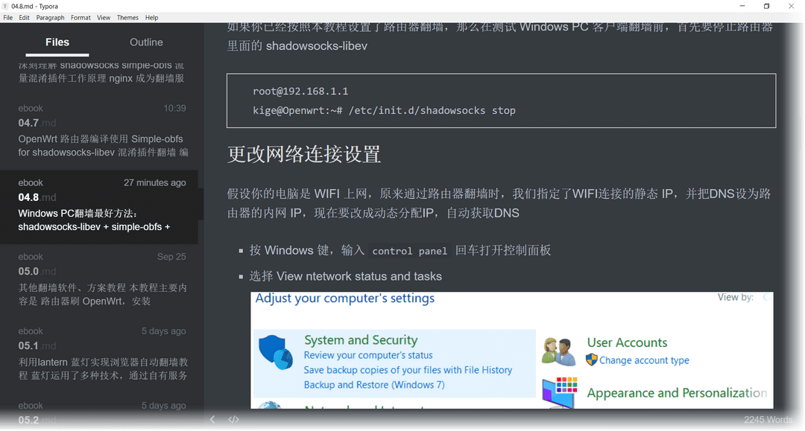

本地阅读本教程的方法
==================

git clone项目
--------

    cd ~/Downloads
    git clone https://github.com/softwaredownload/openwrt-fanqiang

下载Markdwon阅读软件 Typora
--------

Typora有个神奇的地方，就是 Markedown 写作和预览是一体的这就避免了多数 Markdown 写作软件会有的尴尬：边写作边预览时，屏幕宽度始终不够

下载后，点击菜单 `File` 选择 `Open Folder...` 选择 fanqiang/ebook

点击左边的导航栏切换内容

你是个有爱心的人，阅读了本教程，想要回馈这个开源项目，在阅读时顺便修改一些错字，加进补充内容，增加一章你的路由器应用本教程翻墙的过程等等，然后提交　pull request

**相关资源**:

- https://software-download.name/2014/fanqiang-jiaocheng/
- https://typora.io
- https://fanqiang.software-download.name/