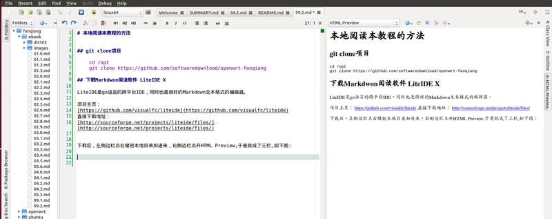

# 本地阅读本教程的方法

## git clone项目

	cd /opt
	git clone https://github.com/softwaredownload/openwrt-fanqiang

## 下载Markdwon阅读软件 LiteIDE X

LiteIDE是go语言的跨平台IDE，同时也是很好的Markdown文本格式的编辑器。

* 项目主页：
[https://github.com/visualfc/liteide](https://github.com/visualfc/liteide)
* 直接下载地址：
[http://sourceforge.net/projects/liteide/files/](http://sourceforge.net/projects/liteide/files/)

下载后，左侧边栏点右键把本地目录加进来，右侧边栏点开HTML Preview,于是就成了三栏,Ubuntu下如下图：

## LiteIDE 使用方法

* 阅读时把中间栏宽度拉小,左边栏是导航栏，右边栏是HTML Preview

* 把中间文档栏宽度拉大，阅读Markdown源文件，贡献本项目

你是个有爱心的人，阅读了本教程，想要回馈这个开源项目，在阅读时顺便修改一些错字，加进补充内容，增加一章你的路由器应用本教程翻墙的过程等等，然后提交　pull request.
