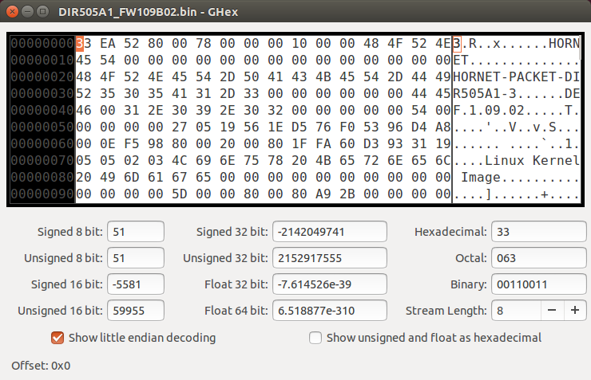
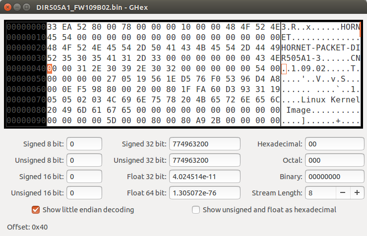
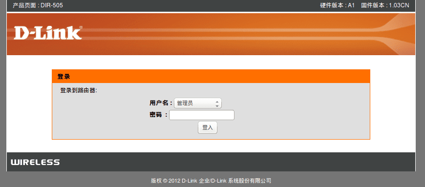
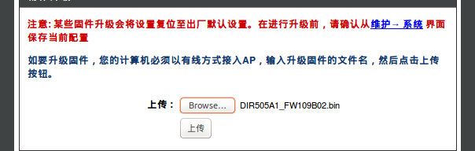
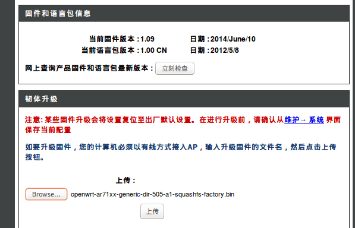

# D-Link DIR-505 A1 刷 OpenWrt固件过程

D-Link 路由器是锁区的, 不能直接刷OpenWrt 固件。要先到D-Link 官方国际站下载原厂固件，用16进制编辑器把DEF改成CN，升级固件，再刷OpenWrt固件。

## 下载D-Link DIR-505 A1 国际版官方固件

下载地址：
* [http://support.dlink.com.au/download/download.aspx?product=DIR-505](http://support.dlink.com.au/download/download.aspx?product=DIR-505)
* [ftp://files.dlink.com.au/products/DIR-505/REV_A/Firmware/v1.09b02/DIR-505A1_FW109B02.bin](ftp://files.dlink.com.au/products/DIR-505/REV_A/Firmware/v1.09b02/DIR-505A1_FW109B02.bin)

## 用16进制编辑器修改固件的国家代码，DEF改成CN

准备一个16进制编辑器，在本文中，我用的是Ubuntu下的轻量级16进制编辑器GHex,把固件拖到GHex打开固件。

修改后变成如下：

Alt+S保存对固件的修改。

你也可以到下面网址直接下载修改好16进制值的固件：

[https://software-download.name/2014/dlink-dir-505-openwrt-fanqiang/](https://software-download.name/2014/dlink-dir-505-openwrt-fanqiang/)

## 刷修改国家后的官方固件

按照路由器官方手册，电脑连上路由器。

在Ubuntu下电脑连接DIR-505路由器的方法：
　
DIR-505路由器出厂默认设置没有开启DHCP，所以我们要给电脑手动设置和路由器同网段的IPv4地址才能连上路由器。
路由器插上电源。右上角无线信号处，选择 Edit Connections, 选择dlink-xxxx,xxxx为路由器MAC ID的后4位，Edit..., IPv4 Setings, Method选择 Manula手动，Address选择Add, 设置Address为192.168.0.2，Netmask 255.255.255.0, Gateway 192.168.0.1。如此设置好后电脑就能连上无线网络dlink-xxxx了。

浏览器首次进入 http://192.168.0.1 会出现设置向导，点取消，然后会出现密码登陆页面：

直接点击 **登入** 按钮，再点击界面上部的 **维护**，然后点击左侧栏的 **固件** 进入升级固件页面，点击 **Browse...** 上传我们修改好的固件：

然后点击 **上传** 按钮完成刷新固件，接下来就可以刷 OpenWrt固件了。

## DIR-505A1 刷 OpenWrt 固件

### 下载 OpenWrt 固件 for DIR-505A1
* [http://downloads.openwrt.org/snapshots/trunk/ar71xx/](http://downloads.openwrt.org/snapshots/trunk/ar71xx/)
* [http://downloads.openwrt.org/snapshots/trunk/ar71xx/openwrt-ar71xx-generic-dir-505-a1-squashfs-factory.bin](http://downloads.openwrt.org/snapshots/trunk/ar71xx/openwrt-ar71xx-generic-dir-505-a1-squashfs-factory.bin)

### 刷OpenWrt固件
我们是在原厂固件上刷 OpenWrt,一定要下载 factory.bin.上传后，等待150秒，DIR-505A1成功刷上了OpenWrt开源固件。

### 参考：
* [http://my.oschina.net/umu618/blog/268466](http://my.oschina.net/umu618/blog/268466)
