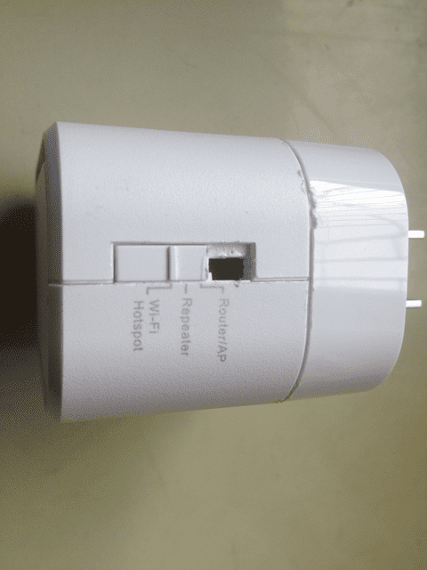

D-Link DIR-505启用工作模式开关
===========================

DIR-505 硬件开启四种应用模式
-----------------------

D-Link DIR-505 在全球销售多款型号，不同型号外观不一样，但内部硬件是一样的。在中国销售的 DIR-505 A1, 也就是本教程所用的型号， 模式开关共有三档，在开关处动动手，就可以启用四种模式

撕掉标贴，去掉螺丝，就可以打开DIR-505,把开关剪短，剪掉挡住开关上推的底面，完工后如下图：

Router模式和AP模式
----------------------------------

便携式式无线路由器常有Router模式和AP模式，有的路由器用两个档位对应这两种模式，拨到Router档就用Router模式，拨到AP档就用AP模式。DIR-505 原厂固件，Router和AP共用一个档位，需要用哪种，需要登录路由器进行选择和设置。现在我们已经刷了 OpenWrt，档位对应的模式需要自己定义设置

在本教程中，把新开的第四档作为AP档，原来的Router/AP档作为Router档

在Router模式时，DIR-505作为无线路由器使用，有线接口作为WAN口，连接到ADSL Modem。计算机通过无线的方式连接到路由器。在这种模式下一般需要设置拨号上网帐号

在AP模式时，通常在DIR-505前端还有路由器，DIR-505的有线接口作为LAN口使用，前端路由器的LAN口引出网线连接到DIR-505. 在宾馆上网，把有线扩展为无线常应用此种模式

/etc/rc.local 利用　GPIO 读取开关位置
-----------------------

rc.local内容如下：

    # Put your custom commands here that should be executed once
    # the system init finished. By default this file does nothing.

    if [ ! -f /etc/config/backup/network ]; then
            cp /etc/config/network /etc/config/backup/
            cp /etc/config/wireless /etc/config/backup/
            cp /etc/config/firewall /etc/config/backup/
            cp /etc/config/dhcp /etc/config/backup/
    fi

    read_gpio() {
     (echo $1 > /sys/class/gpio/export) >& /dev/null
     (echo "in" > /sys/class/gpio/gpio$1/direction) >& /dev/null
     return `cat /sys/class/gpio/gpio$1/value`;
    }
    read_gpio 19;
    v=$?;
    read_gpio 20;
    v=$v$?;
    read_gpio 21;
    v=$v$?;
    read_gpio 22;
    v=$v$?;
    read_gpio 23;
    v=$v$?;
    case "$v" in
     10001) v="router";;
     11001) v="repeater";;
     01001) v="hotspot";;
     11000) v="ap";;
     *) v="error";;
    esac

    /usr/bin/$v

    logger working mode: $v

    exit 0

原理：先备份原始的配置文件，不同模式的设置都是基于原始配置文件，以免出现混乱

在/usr/bin目录下创建相应模式的bash文件，根据不同的GPIO值调用的不同的文件
在本教程中中主要应用 /usr/bin/router和 /usr/bin/ap这两个文件

代码的最新版本，请查看:

- [https://github.com/softwaredownload/openwrt-fanqiang/tree/master/openwrt/dir505](https://github.com/softwaredownload/openwrt-fanqiang/tree/master/openwrt/dir505)

你使用时，可以直接下载整个项目到本地，所有配置文件自然在其中:

    git clone https://github.com/softwaredownload/openwrt-fanqiang　

**相关资源**:

- [https://my.oschina.net/umu618/blog/273945](https://my.oschina.net/umu618/blog/273945)
