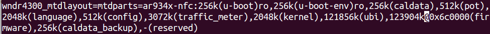

下载和设置OpenWrt Image Builder for 网件Netgear WNDR4300路 由器
===========================================

编译详细过程见 [使用Image Builder编译自动翻墙OpenWrt固件](../04.3.md) 

网件Netgear WNDR4300路由器完全使用128Ｍ内存教程
--------

将ubi和firmware增加96M，完全使用128M flash,以实现 WNDR4300路由器 overlay分区大于90MB的功能

在linux下用vi命令可以很方便地查找和修改特定字符

- 查找23552k，替换成121856k  
- 查找25600k，替换成123904k

下面就用vi来修改：

    cd ~/Downloads/openwrt-imagebuilder/target/linux/ar71xx/image
    cp legacy.mk legacy.mk.bak

    vi legacy.mk

    #change ubi size to 121856k
    # search
    /23552k
    # delete word
    dw
    # insert
    i
    121856k

    #change firmware size to 123904k
    /25600k
    dw
    i
    123904k

    #Save and exit
    ZZ

更加简单的方法是用 sed 替换：

    sed -i s/'23552k(ubi),25600k@0x6c0000(firmware)'/'121856k(ubi),123904k@0x6c0000(firmware)'/ ./legacy.mk

修改好后是这样的：  

	

根据[此文](https://kiritox.me/archives/flash-wndr3700v4-to-stock-firmware.html)，修改Flash布局后，再刷原厂固件，路由器可能变砖，请慎重：

> 对比可以看出来Openwrt做到了和原版一致的Flash分区，因此正常情况下通过TFTP方式刷官方固件因为分区一致是不会有什么问题的。但是如果之前刷入过增加可用空间的改版Openwrt固件的话，原始的Flash分区就会被破坏

预编译固件都是修改了此二值的

**相关资源**:
- https://github.com/softwaredownload/openwrt-fanqiang/blob/master/ebook/04.3.md
- https://kiritox.me/archives/flash-wndr3700v4-to-stock-firmware.html