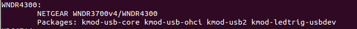

下载和设置OpenWrt Image Builder for 网件Netgear WNDR4300路 由器
===========================================

下载OpenWrt ImageBuilder时有二种选择：稳定发行版和最新trunk版

OpenWrt ImageBuilder for 网件Netgear WNDR4300稳定发行版的下载
--------

进入网址： http://downloads.openwrt.org/

现在是2018年9月22日，可以看到：

> OpenWrt 18.06.1
> Released: Sat, 18 Aug 2018

WNDR4300是NAND内存，进入下面的网址下载适合WNDR4300的ImageBuilder稳定发行版:

http://downloads.openwrt.org/releases/18.06.1/targets/ar71xx/nand/

OpenWrt ImageBuilder for 网件Netgear WNDR4300最新trunk版的下载
--------

Linux下，下载工具一般默认保存到 ~/Downloads，工作在Downloads目录，下载，解压和编译也比较方便

    cd ~/Downloads
    wget http://downloads.openwrt.org/snapshots/targets/ar71xx/nand/openwrt-imagebuilder-ar71xx-nand.Linux-x86_64.tar.xz
    tar -xf openwrt-imagebuilder-ar71xx-nand.Linux-x86_64.tar.xz
    # 为操作方便，重命名为简单目录
    mv openwrt-imagebuilder

网件Netgear WNDR4300路由器完全使用128Ｍ内存教程
--------

将ubi和firmware增加96M，完全使用128M flash,以实现 WNDR4300路由器 overlay分区大于90MB的功能

在linux下用vi命令可以很方便地查找和修改特定字符

- 查找23552k，替换成121856k  
- 查找25600k，替换成123904k

下面就用vi来修改：

    cd ~/Downloads/openwrt-imagebuilder/target/linux/ar71xx/image
    cp legacy.mk legacy.mk.bak

    vi legacy.mk

    #change ubi size to 121856k
    # search
    /23552k
    # delete word
    dw
    # insert
    i
    121856k

    #change firmware size to 123904k
    /25600k
    dw
    i
    123904k

    #Save and exit
    ZZ

更加简单的方法是用 sed 替换：

    sed -i s/'23552k(ubi),25600k@0x6c0000(firmware)'/'121856k(ubi),123904k@0x6c0000(firmware)'/ ./legacy.mk

修改好后是这样的：  

	

根据[此文](https://kiritox.me/archives/flash-wndr3700v4-to-stock-firmware.html)，修改Flash布局后，再刷原厂固件，路由器可能变砖，请慎重：

> 对比可以看出来Openwrt做到了和原版一致的Flash分区，因此正常情况下通过TFTP方式刷官方固件因为分区一致是不会有什么问题的。但是如果之前刷入过增加可用空间的改版Openwrt固件的话，原始的Flash分区就会被破坏

预编译固件都是修改了此二值的

确定网件Netgear WNDR4300路由器的PROFILE值
--------

    cd openwrt-imagebuilder
    make info

下图最上面一行显示，PROFILE值是WNDR4300：

确定应该包含在自编译WNDR4300路由器翻墙固件里的包
--------

**在Linux下运行命令自动获取基础包**：

    echo $(wget -qO - http://downloads.openwrt.org/releases/18.06.1/targets/ar71xx/nand/config.seed | sed -ne 's/^CONFIG_PACKAGE_\([a-z0-9-]*\)=y/\1/ip')

结果如下：

> base-files busybox dnsmasq dropbear firewall fstools jsonfilter libc libgcc mtd netifd opkg procd swconfig ubox ubus ubusd uci usign kmod-lib-crc-ccitt kmod-ip6tables kmod-ipt-conntrack kmod-ipt-core kmod-ipt-nat kmod-nf-conntrack kmod-nf-conntrack6 kmod-nf-ipt kmod-nf-ipt6 kmod-nf-nat kmod-ipv6 kmod-ppp kmod-pppoe kmod-pppox kmod-slhc kmod-gpio-button-hotplug kmod-spi-bitbang kmod-spi-gpio kmod-ath kmod-ath9k kmod-ath9k-common kmod-cfg80211 kmod-mac80211 libip4tc libip6tc libxtables libblobmsg-json libexpat libiwinfo libjson-c libnl-tiny libubox libubus libuci ip6tables iptables hostapd-common iw odhcp6c odhcpd ppp ppp-mod-pppoe wpad-mini iwinfo jshn libjson-script procd-nand ubi-utils uboot-envtools

**获取网件Netgear WNDR4300路由器相关包**：

    make info
    Current Target: "ar71xx (Generic devices with NAND flash)"
    Default Packages: base-files libc libgcc busybox dropbear mtd uci opkg netifd fstools kmod-gpio-button-hotplug swconfig kmod-ath9k wpad-mini uboot-envtools dnsmasq iptables ip6tables ppp ppp-mod-pppoe firewall odhcpd odhcp6c
    Available Profiles:
    ...
    WNDR4300:
        NETGEAR WNDR3700v4/WNDR4300
        Packages: kmod-usb-core kmod-usb-ohci kmod-usb2 kmod-ledtrig-usbdev

那就再增加上面的Default Packages和WNDR4300 Packages。去重排序后，再去掉dnsmasq

**增加自定义包**：

    ipset wget libopenssl shadowsocks-libev luci-ssl iptables-mod-nat-extra bind-dig dnsmasq-full

Dnsmasq 提供 DNS 缓存和 DHCP 服务功能。作为域名解析服务器(DNS)，dnsmasq可以通过缓存 DNS 请求来提高对访问过的网址的连接速度。作为DHCP 服务器，dnsmasq 可以为局域网电脑提供内网ip地址和路由

默认的dnsmasq为base版本，该版本不能对特定的域名地址进行标记操作（因为我们需要对一些特定域名如twitter等进行标记），改为更加强大的dnsmasq-full

luci-ssl是用来网页界面管理路由器，安装后就可以　https://192.168.1.1 登录WNDR4300路由器

bind-dig可以调试域名解析

shadowsocks-libev　翻墙主角

**相关资源**:

- https://kiritox.me/archives/flash-wndr3700v4-to-stock-firmware.html