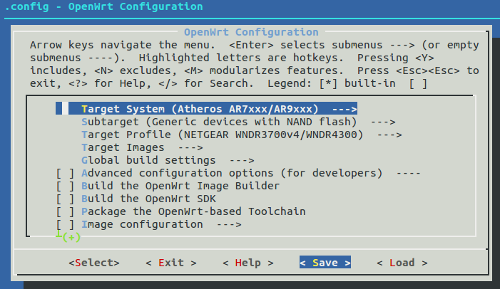

编译shadowsocks-libev ipk for网件Netgear WNDR4300路由器
================================

不同OpenWrt版本下编译的shadowsocks-libev ipk一般是不能通用的。比如现在用的是trunk版的OpenWrt，如果使用OpenWrt Chaos Calmer 15.05 下编译的shadowsocks-libev，可能安装后根本不能启动

前面我曾编译出翻墙固件，其中shadowsocks-libev是别人编译，从sourceforge上下载的，刷上固件后，shadowsocks总是没有自动启动，运行/usr/bin/ss-redir，报告没有找到这个文件，其实文件是在的，只是不兼容。所以，最好还是自行编译shadowsocks-libev

按官网的[说法](https://openwrt.org/docs/guide-developer/build-system/use-buildsystem)，以下 **不要使用root用户来操作**

使用SDK编译ipk的新方法教程请参考：[编译shadowsocks-libev for OpenWrt ipk安装包](../04.1.md)（2018年9月更新）

如果你想节省时间，建议下载预编译的shadowsocks-libev for OpenWrt ipk安装包：

[https://software-download.name/2014/shadowsocks-libev-polarssl-ar71xx-ipk-latest/](https://software-download.name/2014/shadowsocks-libev-polarssl-ar71xx-ipk-latest/)

编译shadowsocks-libev ipk安装包（最后更新于2016年）
--------

下面都是在Linux下操作

    cd ~/Downloads
    git clone git://git.openwrt.org/openwrt.git

    pushd package
    git clone https://github.com/shadowsocks/shadowsocks-libev.git
    popd

    cd ~/Downloads/openwrt
    ./scripts/feeds update -a
    ./scripts/feeds install -a

    make defconfig
    make prereq
    make menuconfig

    ＃ Target System: Atheros AR7xxx/AR9XXX
    ＃ Subtarget: Generic device with NAND flash
    ＃ Target Profile: (因我们只是编译包，这步可以不选)
    ＃ Network, 选择shadowsocks-libev-openssl 和 shadowsocks-libev-polarssl,  按m设置为编译独立ipk安装包
    ＃ Save && Exit

    #　这一步花了几个小时
    make tools/install && make toolchain/install

    # 开始编译
    make V=99 package/shadowsocks-libev/openwrt/compile

输出文件在　openwrt/bin/ar71xx/packages/base/目录下，主要有：

    shadowsocks-libev_2.4.3_ar71xx.ipk
    shadowsocks-libev-polarssl_2.4.3_ar71xx.ipk
    libopenssl_1.0.2e-1_ar71xx.ipk
    libpolarssl_1.3.15-1_ar71xx.ipk

把所有ipk都复制到ImageBuilder的packages目录下

    cd ~/Downloads/openwrt/bin/ar71xx/packages/base/
    cp * ~/Downloads/openwrt-imagebuilder/packages

**相关资源**:

- <https://software-download.name/2014/shadowsocks-libev-polarssl-ar71xx-ipk-latest/>
- <https://software-download.name/2015/netgear-wndr4300-openwrt-fanqiang-gujian/>