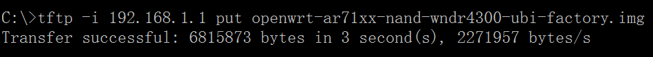

网件Netgear WNDR4300路由器怎样刷OpenWrt自动翻墙固件
=============================================

两种翻墙固件格式 img tar的区别
--------

    openwrt-ar71xx-nand-wndr4300-ubi-factory.img
    openwrt-ar71xx-nand-wndr4300-squashfs-sysupgrade.tar

我们编译出了两种固件，一种为 ...ubi-factory.img 格式，一种为 ...squashfs-sysupgrade.tar 格式。 其中 img 格式只能用 tftp 的方法刷入。而 tar 只能通过已刷了Openwrt的WEB端进行刷入。下面分别说明 两种不同的刷入方法：

tftp刷固件的方式，不管原来的固件是什么格式，都可以刷factory.img

网件Netgear WNDR4300路由器进入恢复模式的方法
--------

- 关闭路由器电源
- 用 牙签，或其他尖物 按住设备背面的机身背面的红色小圆孔(Restore Factory Settings button)
- 开启电源开关
- 观察电源灯（此时保持按住Restore Factory Settings按钮不要松手），直到电源灯由 橙色闪烁 状态变到 绿色闪烁 状态（说明设备已经进入到了 TFTP修复模式 ）

Linux下Netgear WNDR4300路由器用tftp刷翻墙固件
--------

- 将电脑用网线连接到设备的 LAN口，而不是wan口。国行Netgear WNDR4300的wan口是黄色的
- 将电脑的本地连接IP设置为 192.168.1.X （此例中IP地址设置为 192.168.1.9），子网掩码为 255.255.255.0，网关为192.168.1.1
- 路由器进入恢复模式
- 测试能否连接到路由器：

        ping 192.168.1.1
        PING 192.168.1.1 (192.168.1.1) 56(84) bytes of data.
        Warning: time of day goes back (-3646479862160196504us), taking countermeasures.
        Warning: time of day goes back (-3646479862160196420us), taking countermeasures.

- 网件Netgear WNDR4300路由器刷翻墙固件

        sudo apt-get install tftp
        #　进入固件所在目录
        cd ~/Downloads/openwrt-imagebuilder/bin/targets/ar71xx/nand
        echo -e "binary\nrexmt 1\ntimeout 60\ntrace\nput openwrt-18.06.1-ar71xx-nand-wndr4300-ubi-factory.img\n" | tftp 192.168.1.1

- 观察指示灯，文件会在5秒内传送完毕，等待80秒左右，设备会自动重启（请耐心等待，切勿将路由器手动断电）。设备重启后，看到亮绿灯，一定要按机身后面的电源开关手动断电、开机，否则可能没有无线5G 这不是BUG，其他openwrt也是一样的。每次刷factory.img都要这样

    路由器完成初始化需要几分钟时间， 2.4G 和 5G 的无线信号灯才会亮起，请耐心等待

Windows下Netgear WNDR4300路由器用tftp刷翻墙固件
--------

- 启用tftp。Windows 10下：控制面板，所有控制面板项，程序和功能，启用或关闭Windows功能，启用“TFTP”客户端
- 将电脑用网线连接到设备的 LAN口
- 将电脑的本地连接IP设置为 192.168.1.X （此例中IP地址设置为 192.168.1.9），子网掩码为 255.255.255.0，网关192.168.1.1
- 路由器进入恢复模式
- 测试能否连接到路由器： ping 192.168.1.1
- 网件Netgear WNDR4300路由器刷翻墙固件
  - 按Windows+R,输入cmd并回车调出命令行程序
  - 假设openwrt-ar71xx-nand-wndr3700v4-ubi-factory.img在C:\盘
    - 运行命令：

            cd C:\
            tftp -i 192.168.1.1 put openwrt-ar71xx-nand-wndr3700v4-ubi-factory.img

        

- 观察指示灯，设备重启后，看到亮绿灯，再手动断电、开机，否则可能没有无线5G

**相关资源**:

- <https://software-download.name/2015/netgear-wndr4300-openwrt-fanqiang-gujian/>
- [https://openwrt.org/docs/guide-user/installation/generic.flashing.tftp](https://openwrt.org/docs/guide-user/installation/generic.flashing.tftp)
- [Windows下Netgear WNDR4300刷OpenWrt固件PDF教程 by 书浅](https://software-download.name/2015/netgear-wndr4300-shua-openwrt/)