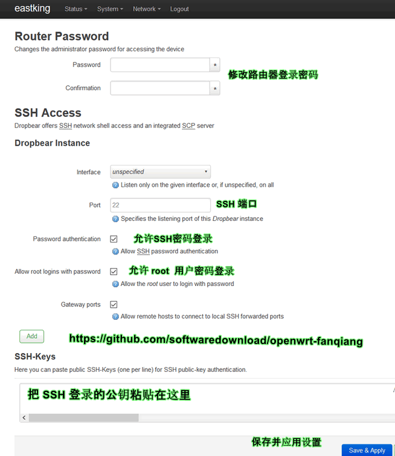
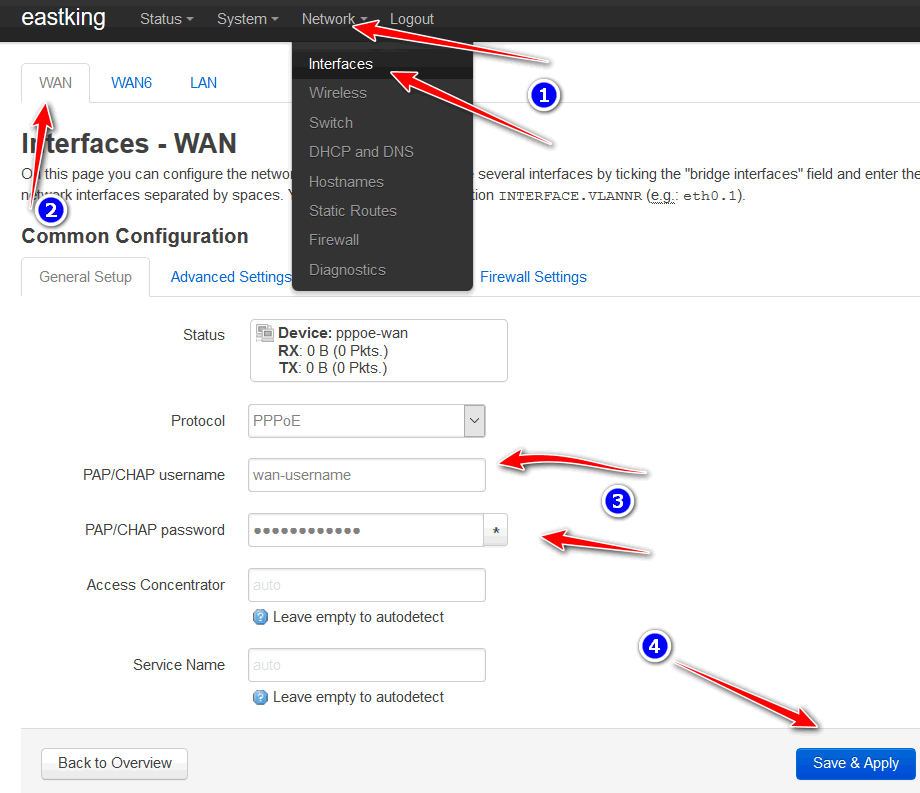

登录并设置已经刷了OpenWrt 翻墙固件的网件Netgear WNDR4300路由器
===================================================

Netgear WNDR4300 (2018版)预编译翻墙固件下载
--------

[https://software-download.name/2015/netgear-wndr4300-openwrt-fanqiang-gujian/](https://software-download.name/2015/netgear-wndr4300-openwrt-fanqiang-gujian/)

你按照[本教程](https://github.com/softwaredownload/openwrt-fanqiang)编译了WNDR4300路由器 OpenWrt 全自动翻墙固件，并且刷进了路由器，如果一切正常，就可以零设置自动翻墙了。运气不够好，就要登录路由器修改一下设置

你懶得自己编译翻墙固件，下载了本教程提供的Netgear WNDR4300路由器翻墙固件并刷进了路由器，就必须手动修改一些值才能自动翻墙

本教程就针对上面这两种情况

怎样登录已经刷了OpenWrt 翻墙固件的网件Netgear WNDR4300路由器
--------

用网线连接电脑和路由器，将电脑的本地连接IP设置为 192.168.1.97，子网掩码为 255.255.255.0，网关为：192.168.1.1

- 网页登录地址： http://192.168.1.1
- ssh登录：　ssh root @192.168.1.1
- 默认登录密码： fanqiang

网页登录 WNDR4300 管理界面并修改设置
------

在浏览器地址栏输入 **192.168.1.1** 并回车

- 修改路由器密码和 SSH 登录设置

    鼠标移到顶部菜单栏 **System** (系统), 再点击 **Administration** (管理员设置)

    

    2018 版预编译翻墙固件，需要把公钥粘贴在 **SSH-Keys** 的空白格子里，否则可能无法 ssh 登录路由器

    修改好设置后，点击 **Save & Apply** (保存并应用)

- 设置拨号上网用户名和密码

    1. 鼠标移到顶部菜单栏 **Network** (网络)， 再点击 **Interfaces** (接口)
    2. 点击左上角的 **WAN** 标签
    3. 修改拨号上网 PPPoE 用户名和密码
    4. 点击 **Save & Apply** 保存设置并应用

    

Linux下ssh登录WNDR4300路由器并修改设置
--------

- 对于2018版预编译翻墙固件，参考上面的教程 先在网页管理界面添加 SSH 登录的公钥，否则可能无法 ssh 登录路由器

- 创建 ssh 自动登录的 host

    在 Linux 下是修改 **~/.ssh/config** 文件。Windows 下可以安装 MSYS2 或 Git for Windows 并修改相应的文件

    **~/.ssh/config**

        Host router
        HostName 192.168.1.1
        User root
        Port 22
        IdentityFile ~/path/to/rsa/file

    其中 **IdentityFile** 后面写 SSH 私钥文件的路径

    然后就可以在命令行里免密码自动登录路由器：

       $ ssh router

- 命令行登录路由器后，修改 shodowsocks-libev 配置文件

    主要修改 **server** 和 **server_port**(注意，如果有拼写错误，请修正，否则 SS 将无法启动)
    
        root@OpenWrt:~# vi /etc/shadowsocks-libev/config.json

- 添加服务器 IP 地址到 **ip_server.txt**, 一行一个IP地址

        root@OpenWrt:~# vi /etc/shadowsocks-libev/ip_server.txt

- 添加自定义的白名单 IP 地址到 **ip_custom.txt**, 一行一个IP地址。可以跳过这步

        root@OpenWrt:~# vi /etc/shadowsocks-libev/ip_custom.txt

- 命令行修改拨号上网用户名和密码

        # wan-username, wan-password
        root@OpenWrt:~# vi /etc/config/network

- 命令行修改 WIFI 密码

        # wifi password, optional
        root@OpenWrt:~# vi /etc/config/wireless

如果你修改了本教程默认的shadowsocks local_port和tunnel_port，还得修改/etc/dnsmasq.d/下相关文件中的端口号

执行以下命令使修改生效
--------

    root@OpenWrt:~# /etc/init.d/shadowsocks stop
    root@OpenWrt:~# /etc/init.d/shadowsocks start
    root@OpenWrt:~# /etc/init.d/dnsmasq restart
    root@OpenWrt:~# /etc/init.d/network restart

**相关资源**:

- <https://software-download.name/2015/netgear-wndr4300-openwrt-fanqiang-gujian/>