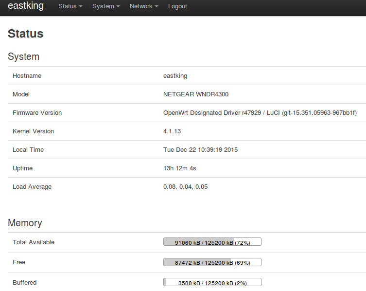

# 网件Netgear WNDR4300刷OpenWrt翻墙教程

网件Netgear WNDR4300是很多网友推荐的可刷OpenWRT的无线路由器。

WNDR4300有v1和v2的区别，目前国行都是v1版本。

## 网件Netgear WNDR4300无线路由器的优点

* 刷OpenWrt方便。购买后，登陆管理界面可以直接刷OpenWrt
* WNDR4300自带不死uboot，刷机比较安全
* 硬件配置高。据网友测试，同时接入40台机器都没有问题
* 无线信号强。150平方的室内基本无信号死角
* 有一个 USB 接口，可以挂载设备

## 网件Netgear WNDR4300国行硬件信息

千兆双频，300+450Mbps的无线连接，2.4G和5G无线信号可以同时使用，1000Mbps有线端口，内置5天线（两根5G+三根2.4G），采用Atheros AR9344处理器，频率550MHz，128M DDR2内存，128M ROM，USB可接硬盘进行共享，带有wifi开关按钮可以单独关闭无线信号。

	Version		v1 	 	 	 
	CPU			Atheros AR9344 rev2 560MHz MIPS 74Kc V4.12
	Ram			128MiB
	Flash		128MiB NAND
	Network		1 WAN + 4x LAN (GBit)
	Wireless	AR9580 [an 3x3:3] + AR9344 [bgn 2x2:2]
	USB			Yes

## 如何购买网件Netgear WNDR4300无线路由器

目前自营电商的价格一般是299元，TB价大约280元。

## 参考信息
* [Netgear WNDR4300 OpenWrt官网Wiki](https://wiki.openwrt.org/toh/netgear/wndr4300)
* [Windows下Netgear WNDR4300刷OpenWrt固件PDF教程 by 书浅](https://software-download.name/2015/netgear-wndr4300-shua-openwrt/)
* [gy408预编译集成固件for WNDR4300](https://github.com/gygy/gygy.github.io)

---

#### 最简单的路由器刷OpenWrt固件翻墙教程:
[https://github.com/softwaredownload/openwrt-fanqiang](https://github.com/softwaredownload/openwrt-fanqiang "最简单的路由器刷OpenWrt固件翻墙教程")

#### 在线阅读OpenWrt翻墙路由器教程:
[http://openwrtfanqiang.software-download.name](http://openwrtfanqiang.software-download.name)